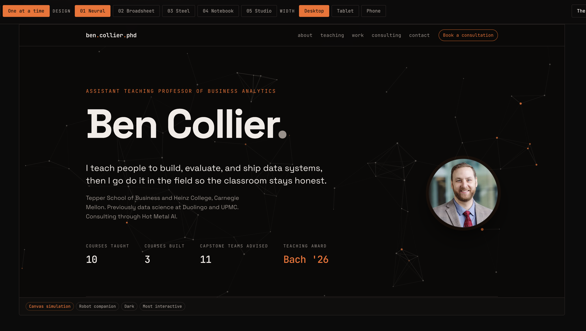
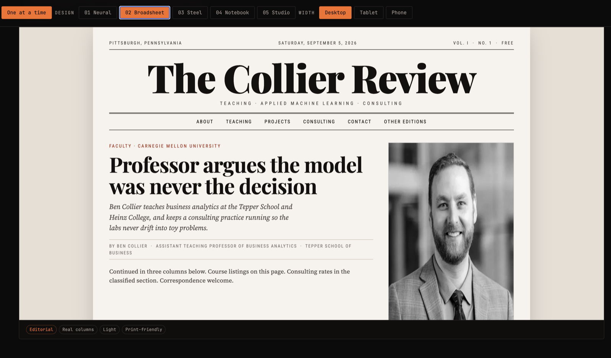
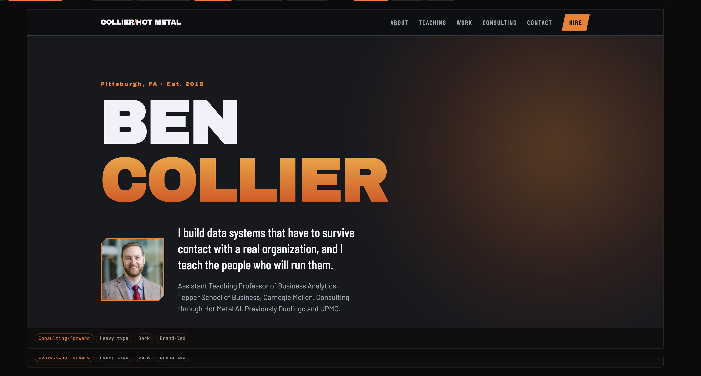
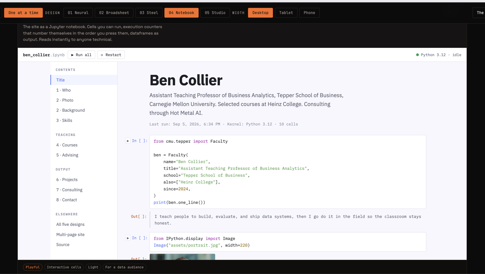
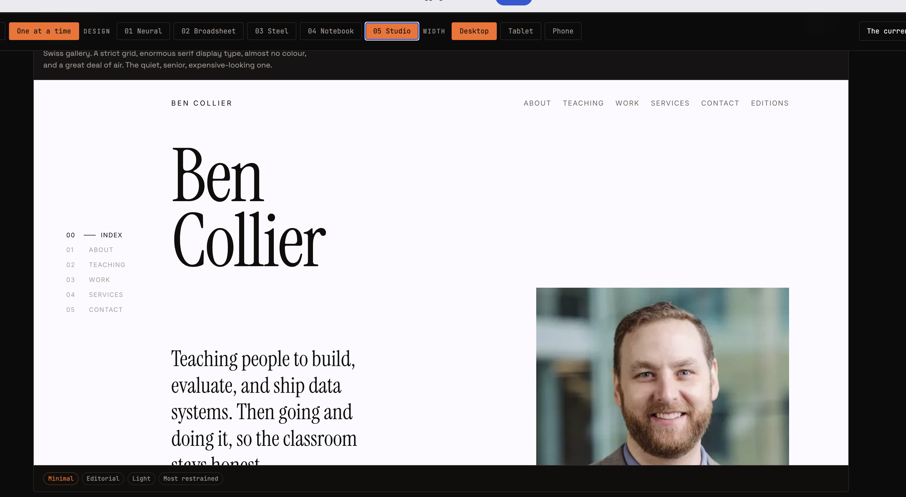
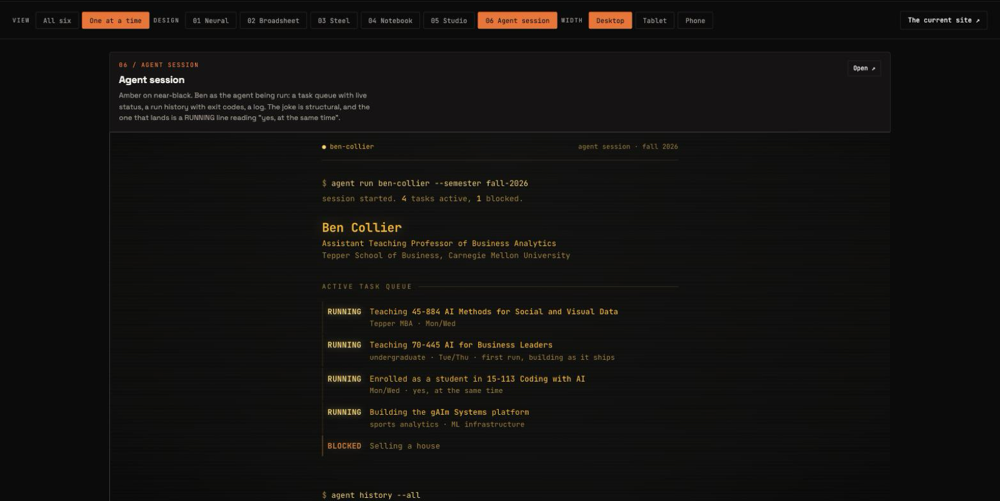

# ben.collier.phd

Faculty site for [Ben Collier](https://www.linkedin.com/in/bcollierphd), Assistant Teaching Professor of Business Analytics at the Tepper School of Business, Carnegie Mellon University.

Static HTML/CSS/JS, generated by a Python script and committed to the repo, so what is
in the repo is exactly what is served. No framework, no bundler, no CMS, no npm
dependencies. See [Build](#build).

- **Host:** GitHub Pages, from `main` at the repo root
- **Live now:** <https://bcollier.github.io/ben.collier.phd/>
- **Compare the designs:** <https://bcollier.github.io/ben.collier.phd/designs/>
- **Final URL:** `https://ben.collier.phd` (attach later — see below)
- **Apex:** `collier.phd` redirects to `ben.collier.phd`

---

## Six designs, one site

Same content, same facts, six completely different design arguments. Every one is
a working page: real links, real consulting rates, responsive, keyboard
navigable. Pick one and it becomes the site.

They are live and side by side at
**[/designs/](https://bcollier.github.io/ben.collier.phd/designs/)**, which
renders all six in iframes with a desktop / tablet / phone width switcher, so
you can check responsiveness without resizing a window. The screenshots below
are that page in its one-at-a-time view.

### 01 — Neural

Dark instrument panel. The background is a live network simulation that reacts
to your cursor, and a small robot wanders in every 25 to 55 seconds to follow
it. The AI-heavy one.

[](https://bcollier.github.io/ben.collier.phd/designs/neural/)

### 02 — Broadsheet

An actual newspaper. Real CSS multi-column text, a drop cap, hairline rules, a
live dateline, and consulting rates set as classified ads. Prints properly.

[](https://bcollier.github.io/ben.collier.phd/designs/broadsheet/)

### 03 — Steel

Pittsburgh industrial, and the Hot Metal AI design. Molten orange on steel grey,
riveted plate edges drawn in CSS, and a temperature gauge that fills as you
scroll.

[](https://bcollier.github.io/ben.collier.phd/designs/steel/)

### 04 — Notebook

The site as a Jupyter notebook. Cells you can run, execution counters that
number themselves in the order you press them, dataframes as output. Reads
instantly to anyone technical.

[](https://bcollier.github.io/ben.collier.phd/designs/notebook/)

### 05 — Studio

Swiss gallery. A strict grid, enormous serif display type, almost no colour, and
a great deal of air. The quiet, senior, expensive-looking one.

[](https://bcollier.github.io/ben.collier.phd/designs/studio/)

### 06 — Agent session

Amber on near-black. Ben as the agent being run: a task queue with live status,
a run history with exit codes, a log. The joke is structural, and the line that
lands is a RUNNING entry reading "yes, at the same time". Runs standalone from
`file://` with no server. See its own
[README](designs/agent/README.md) for the full rationale.

[](https://bcollier.github.io/ben.collier.phd/designs/agent/)

---

## How this site was built, and with what

Two AI coding tools built this, in two sessions, and both kept a record. The
logs are the coursework deliverable for 15-113 Project 1, but they are also the
honest answer to "how much of this did you write".

| Document | Tool | What it covers |
| --- | --- | --- |
| [`cursor-ai-code-assistance-chat-history.md`](cursor-ai-code-assistance-chat-history.md) | Cursor Cloud Agent | The first session, 30 August 2026. Getting a correct, deployable, multi-page site to exist at all. Thirteen steps, each naming its commit. |
| [`claude-code-chat-history.md`](claude-code-chat-history.md) | Claude Code, Opus 5 | The second session, 5 September 2026. Taking that scaffold to six finished design directions. Four steps, each naming its commit. |
| [`PROMPTS.md`](PROMPTS.md) | Both | The reflective prompt log required by the assignment. Less narrative, more argument: what got rejected and why. |

The two chat histories are complementary rather than duplicative. The Cursor one
is about making something correct. The Claude Code one is about making it good,
which turned out to mean removing most of what the model added.

Every design file also carries an `AI USAGE NOTE` comment block at the top of
its stylesheet, naming what was drafted and what was changed by hand.

---

Absolute URLs (canonical tags, Open Graph, `sitemap.xml`, `feed.xml`) all come from
`data/site.json`. While `domain_live` is `false` they point at the github.io address,
because a canonical tag aimed at a domain that does not resolve tells Google the real
page is a dead link. `scripts/enable_domain.sh` flips it.

## Build

Every `.html` file in this repo is generated by `scripts/build.py` and committed.
There is no CI and no deploy step: GitHub Pages serves `main` at the repo root
exactly as committed, so the build output **is** the site.

Requires Python 3 and nothing else. The script imports only the standard library,
so there is nothing to install and no virtualenv to activate.

```bash
python3 scripts/build.py        # or: npm run build
```

It prints one line per file and finishes by naming the host the absolute URLs
point at:

```
wrote index.html
wrote courses/index.html
...
wrote feed.xml
done — absolute URLs point at https://bcollier.github.io/ben.collier.phd
```

### What it reads

| Source | Feeds |
| --- | --- |
| `data/site.json` | Every page's `<head>` — canonical, Open Graph, JSON-LD — plus `sitemap.xml` and `feed.xml` |
| `data/cv.md` | `/cv/`, through a small Markdown subset renderer in the script |
| `data/students.json` | `/students/` — roster and advised papers |
| `data/projects.json` | Nothing at the moment. Sample student projects are held back from the site for now; the data stays here for when they return |
| `COURSES` in `scripts/build.py` | `/courses/`, every course page, the home page, `sitemap.xml` |
| `NEWS` in `scripts/build.py` | `/news/`, the five latest on `/`, and `feed.xml` |

Courses and the news log live in `scripts/build.py` itself, not in `data/`. To add
a course or a news item, edit those two lists near the top of the script. The
remaining pages — `/materials/`, `/practice/`, `/teaching/`, `/contact/` — have
their copy written directly in their `build_*()` function.

### What it writes

`index.html`, `404.html`, and an `index.html` under `courses/`, `courses/<slug>/`,
`students/`, `cv/`, `materials/`, `practice/`, `teaching/`, `news/`, and `contact/`
— plus `sitemap.xml`, `robots.txt`, and `feed.xml`.

### When you have to run it

Whenever you change `scripts/build.py`, anything under `data/` except
`linkedin.json`, or anything in the page shell (header, footer, `<head>` tags).
`data/cv.md`, `data/projects.json`, and `data/students.json` are baked into HTML
at build time — editing them changes nothing on the site until you rebuild.

`data/linkedin.json` is the exception. It is fetched in the browser at runtime by
`js/site.js`, so posts appear with no rebuild. `css/site.css`, `js/site.js`, and
`js/config.js` are served as-is and need no rebuild either.

**Commit the regenerated HTML in the same commit as the change that caused it.**
Nothing runs the build for you, so a `data/` edit committed on its own is a repo
that no longer matches its own site.

One thing to expect in the diff: every run stamps `<lastmod>` in `sitemap.xml`
with today's date, so that file shows as changed even when nothing else did.

The `designs/` pages are hand-written and are not generated. `build.py` never
touches them; it only lists `designs/` in the sitemap.

## Local preview

```bash
python3 -m http.server 43217    # or: npm start
```

Open [http://127.0.0.1:43217](http://127.0.0.1:43217). Serve over HTTP rather than
opening the files directly — `js/site.js` fetches `data/linkedin.json`, which
`file://` blocks.

## Put it on GitHub

The repo should live at **`github.com/bcollier/ben.collier.phd`**.

```bash
gh auth login                   # or: export GITHUB_TOKEN=...
./scripts/setup_github.sh       # creates the repo, pushes main, turns on Pages
```

Override the defaults with `./scripts/setup_github.sh <owner> <repo>`.

**Token permissions.** Creating a repository needs more than you might expect. A fine-grained token must have **Administration: Read and write** — `POST /user/repos` rejects Contents and Pages alone with `Resource not accessible by personal access token`. A classic token needs the whole `repo` scope. Simplest alternative: create the repo in the browser first, then re-run the script, which detects the existing repo and just pushes. For pushing and configuring Pages afterward, a fine-grained token only needs **Contents: write** and **Pages: write**.

Prefer clicking through it? Create `ben.collier.phd` at [github.com/new](https://github.com/new), then:

```bash
git remote add github https://github.com/bcollier/ben.collier.phd.git
git push -u github main
```

Then **Settings → Pages → Deploy from a branch → `main` → `/ (root)`**. `.nojekyll` is committed, so GitHub serves the files as-is. All internal links are relative, so the site works both at a domain root and under `/ben.collier.phd/`.

Hand in the `github.io` URL that Settings → Pages shows.

## Custom domain (do this second)

There is deliberately **no `CNAME` file in the repo yet**. Attaching a custom domain makes GitHub Pages redirect the `github.io` URL to that domain — which would break the link you turn in for class. Ship on `github.io` first.

When you are ready, add DNS at your registrar for `collier.phd`:

| Type | Name | Value |
| --- | --- | --- |
| `CNAME` | `ben` | `bcollier.github.io` |

and a permanent (301) redirect: `collier.phd` → `https://ben.collier.phd/`. A Cloudflare Redirect Rule does this in one step. GitHub Pages only supports one custom domain per site, which is why the apex is a DNS-level redirect rather than a second `CNAME` file.

Then:

```bash
./scripts/enable_domain.sh
```

That writes `CNAME`, pushes, sets the Pages domain, and enables HTTPS enforcement.

## Paste / update content

| What | Where | Rebuild after? |
| --- | --- | --- |
| Full CV | `data/cv.md` | Yes |
| Students, advised papers | `data/students.json` | Yes |
| Course sample projects (currently not rendered) | `data/projects.json` | Yes |
| Courses, news log | `COURSES` / `NEWS` in `scripts/build.py` | Yes |
| Site-wide URLs, name, links | `data/site.json` | Yes |
| LinkedIn shout-outs | `data/linkedin.json` or `scripts/add_linkedin_post.py` | No — fetched at runtime |
| Student photos | `assets/students/<slug>.jpg` or `scripts/fetch_linkedin_photo.py` | Only if you change the `photo` path in `students.json` |
| Paper PDFs | `papers/` | Only if you change the `link` in `students.json` |
| Calendly | `js/config.js` | No — served as-is |
| Styles | `css/site.css` | No — served as-is |
| Social share image | `python3 scripts/make_og_image.py` | No — writes `assets/og.png` directly |

"Rebuild" means `python3 scripts/build.py`, committed alongside the edit. See
[Build](#build).

### Import a LinkedIn post

```bash
python3 scripts/add_linkedin_post.py \
  --url 'https://www.linkedin.com/posts/...' \
  --date 2026-08-30 \
  --text 'Proud of this capstone team for ...' \
  --people 'Student Name' \
  --tags students teaching
```

LinkedIn has no public RSS feed, so posts are stored as a static copy in `data/linkedin.json` and rendered on `/students/` and `/news/`.

### Fetch a LinkedIn photo

```bash
python3 scripts/fetch_linkedin_photo.py --slug michelle-min --linkedin michelle-de-min
```

Then point `"photo"` at it in `data/students.json`. Headshots render as circles, so square source images work best — anything non-square is center-cropped by CSS. Use `assets/students/placeholder.svg` for someone without a photo.

### Add an advised paper

In `data/students.json` → `papers`, replace a placeholder:

```json
{
  "id": "capstone-2026-retail",
  "title": "Pricing segments for a regional grocer",
  "students": ["Ada Example", "Grace Example"],
  "year": "2026",
  "kind": "capstone",
  "summary": "Two-paragraph abstract of the project.",
  "link": "papers/capstone-2026-retail.pdf",
  "status": "public"
}
```

## What the build generates

Beyond the HTML pages:

| File | What it does |
| --- | --- |
| `sitemap.xml` | Every canonical URL, for search engines. |
| `robots.txt` | Points crawlers at the sitemap. |
| `feed.xml` | Atom feed of the news log. Linked from every page's `<head>`. |
| `assets/og.png` | The 1200x630 card LinkedIn and X show when a page is shared. |

`assets/og.png` is committed, so a normal build does not need to regenerate it.
Re-run `python3 scripts/make_og_image.py` after changing the portrait or the title
block; rasterising needs `rsvg-convert` (`brew install librsvg`).

## Site map

- **Home** — portrait, bio, courses built
- **Courses** — built and taught
- **Students** — photos, advised papers, capstone log, LinkedIn highlights
- **Materials** — notebooks, video, workshops
- **Practice** — Hot Metal Data, gAIm Systems
- **CV** — generated from `data/cv.md`
- **News** — dated log
- **Contact** — email, office, Calendly hook
