# ben.collier.phd

The faculty site of [Ben Collier](https://www.linkedin.com/in/bcollierphd), Assistant Teaching Professor of Business Analytics at Carnegie Mellon's Tepper School of Business.

**Live at <https://ben.collier.phd>.** `collier.phd`, `www.collier.phd` and `hotmetal.ai` all forward there.

This README describes the **Field Notebook** revision (late September to October 2026): the site redrawn as a data scientist's working notebook on a lab bench, with hand-inked charts, taped prints, sticky notes, a portrait that docks into the header, and a small robot that visits three times.

| | |
|---|---|
| Hosting | GitHub Pages, from `main` at the repo root |
| Build | One Python script, standard library only: `python3 scripts/build.py` |
| Front end | Hand-written HTML, one stylesheet, plain JavaScript. No framework, no bundler, no npm |
| Libraries | Two, vendored: d3 v7.9.0 and topojson-client v3.1.0, used only on the travel page |
| Charts | Drawn by the site's own ~200-line SVG "pen" (`js/notebook.js`), not a chart library |
| Fonts | Young Serif, Literata, IBM Plex Mono and Kalam, from Google Fonts |
| Data | JSON and Markdown files in `data/`, baked into HTML at build time |

**Contents:** [Architecture](#architecture) · [Pages](#the-pages) · [The pen: how the animation works](#the-pen-how-the-animation-works) · [Data visualization](#data-visualization) · [Code worth sharing with students](#code-worth-sharing-with-students) · [The robot](#the-robot) · [Where the data comes from](#where-the-data-comes-from) · [Domains and deployment](#domains-and-deployment) · [Working on the site](#working-on-the-site) · [Privacy rules](#privacy-rules) · [History](#history-15-113-and-the-six-designs)

---

## Architecture

Everything a visitor sees is a static file in this repo. The build turns data into HTML, the HTML is committed, and GitHub Pages serves the repo as-is.

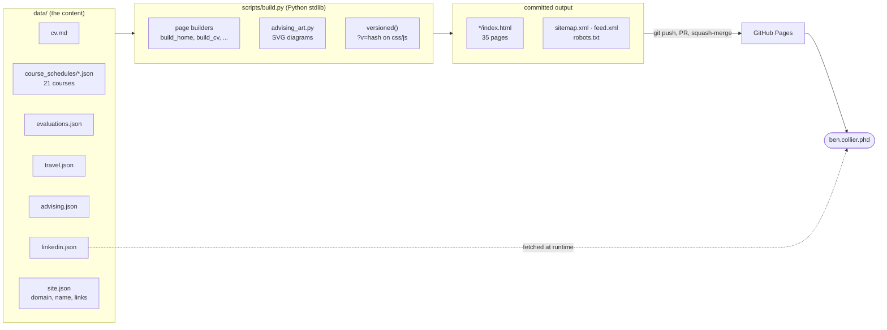
```mermaid
flowchart LR
  subgraph data["data/ (the content)"]
    cv["cv.md"]
    sched["course_schedules/*.json<br/>21 courses"]
    evals["evaluations.json"]
    travel["travel.json"]
    adv["advising.json"]
    li["linkedin.json"]
    site["site.json<br/>domain, name, links"]
  end
  subgraph build["scripts/build.py (Python stdlib)"]
    pages["page builders<br/>build_home, build_cv, ..."]
    art["advising_art.py<br/>SVG diagrams"]
    ver["versioned()<br/>?v=hash on css/js"]
  end
  subgraph out["committed output"]
    html["*/index.html<br/>35 pages"]
    xml["sitemap.xml · feed.xml<br/>robots.txt"]
  end
  data --> build --> out
  out -->|git push, PR, squash-merge| gh["GitHub Pages"]
  gh --> live(["ben.collier.phd"])
  li -. fetched at runtime .-> live
```

In the browser, each page loads the same three scripts, plus one or two page scripts:

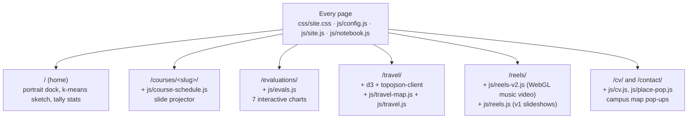
```mermaid
flowchart TB
  every["Every page<br/>css/site.css · js/config.js · js/site.js · js/notebook.js"]
  every --> home["/ (home)<br/>portrait dock, k-means sketch, tally stats"]
  every --> courses["/courses/&lt;slug&gt;/<br/>+ js/course-schedule.js<br/>slide projector"]
  every --> evals["/evaluations/<br/>+ js/evals.js<br/>7 interactive charts"]
  every --> travel["/travel/<br/>+ d3 + topojson-client<br/>+ js/travel-map.js + js/travel.js"]
  every --> reels["/reels/<br/>+ js/reels-v2.js (WebGL music video)<br/>+ js/reels.js (v1 slideshows)"]
  every --> cv["/cv/ and /contact/<br/>+ js/cv.js, js/place-pop.js<br/>campus map pop-ups"]
```

| File | Lines | What it does |
|---|---:|---|
| `scripts/build.py` | ~2,900 | Generates every page, the sitemap, the Atom feed and robots.txt. Course list and news log live here |
| `css/site.css` | ~1,600 | The whole Field Notebook design, every page, plus the CV's print styles |
| `js/notebook.js` | ~780 | The pen: wobbly SVG strokes, charts, scroll reveals, count-ups, the docking portrait, slide piles, the robot |
| `js/evals.js` | ~420 | The evaluation charts, drawn with the pen, with sticky-note tooltips |
| `js/travel-map.js` | ~330 | Flat world map with country and US city dots (d3) |
| `js/travel.js` | ~150 | The spinning globe (d3) |
| `js/reels-v2.js` | ~700 | Reels version 2: WebGL music video renderer that plays `data/reels_v2.json` against the song clock |
| `js/reels.js` | ~150 | The two photo reels on /reels/: crossfade, pan and zoom, place labels, shared music |
| `js/course-schedule.js` | ~160 | The slide "projector" that follows the schedule on course pages |
| `js/course-assistant.js` | ~210 | The course-assistant note: lifts, straightens and opens into the legal-pad hand-off frame (`css/handoff.css`, shared with Faculty Twin), then goes to the twin |
| `js/site.js` | ~130 | Email assembly, LinkedIn feed, booking links |
| `js/place-pop.js` | ~40 | Campus map and building photo pop-ups on /cv/ and /contact/ |

---

## The pages

| Page | What is on it | Notable pieces |
|---|---|---|
| `/` | Hero, bio, career timeline, tally-mark stats, courses, recent news | Portrait that peels off and docks into the header on scroll; red proofreader's caret that writes "PhD" after the name; k-means margin sketch |
| `/courses/` and 21 course pages | Index cards with slide piles; per course: hero slides, week-by-week schedule with a slide projector, assignments, final projects, student quotes | Projector follows the session in view; "What students say" quote cards |
| `/projects/` | Coding with AI projects | |
| `/advising/` | 13 capstones and independent studies | Each print lands face down showing the partner's logo, flips to a diagram that inks itself in |
| `/evaluations/` | Every CMU course evaluation since Fall 2023 | Seven charts, a program filter and an item picker, quote cards, unsolicited notes as letters in envelopes |
| `/consult/`, `/book/` | Consulting and custom education, booking | |
| `/cv/` | The CV from `data/cv.md` | Career-at-a-glance timeline, campus map pop-ups, print stylesheet |
| `/strengths/` | Two StrengthsFinder results, five years apart | Slope chart of theme ranks. History: [strengths/prompt_log.md](strengths/prompt_log.md) |
| `/talks/` | Talks with selected slides | |
| `/travel/` | 27 countries and 55 US cities from the photo library | Flat map and globe, photo pop-ups. Docs: [travel/README.md](travel/README.md), [travel/prompt_log.md](travel/prompt_log.md) |
| `/reels/` | Version 2: a 3:41 music video of the same 171 photos plus 48 place shots. Version 1: two slideshows, Professional Ben and Casual Ben | WebGL beat-cut video with neon grades, glitch, kaleidoscope, grids, seal and mosaic; v1 slideshow with pan and zoom; CC0 music that starts only on play. Docs: [reels/README.md](reels/README.md), [reels/prompt_log.md](reels/prompt_log.md) |
| `/news/` | Dated log plus LinkedIn posts | |
| `/contact/` | Email, office, links | Campus map pop-ups |

---

## The pen: how the animation works

Nothing on the site uses an animation library. The hand-drawn look comes from one idea: **draw every line as a slightly wobbly SVG path, then reveal it by animating `stroke-dashoffset`**, so it appears to be drawn by a pen.

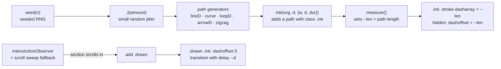
```mermaid
flowchart LR
  seed["seed(n)<br/>seeded RNG"] --> J["J(amount)<br/>small random jitter"]
  J --> gen["path generators<br/>lineD · curve · loopD · arrowD · zigzag"]
  gen --> ink["ink(svg, d, {w, d, dur})<br/>adds a path with class .ink"]
  ink --> measure["measure()<br/>sets --len = path length"]
  measure --> css[".ink: stroke-dasharray = --len<br/>hidden: dashoffset = --len"]
  io["IntersectionObserver<br/>+ scroll sweep fallback"] -->|section scrolls in| drawn["add .drawn"]
  drawn --> css2[".drawn .ink: dashoffset 0<br/>transition with delay --d"]
```

- **Seeded wobble.** `rng(seed)` (`js/notebook.js:20`) is a tiny mulberry32 generator. Every chart seeds it with a fixed number, so the "hand-drawn" jitter is identical on every visit and every reload.
- **Path generators** (`js/notebook.js:40-85`): `lineD` bends a straight line into a cubic curve with jittered control points; `curve` turns a list of points into a smooth Catmull-Rom-style path; `loopD` draws a pen circle that overshoots its start; `arrowD` returns a curved shaft plus a two-stroke head; `zigzag` hatches the inside of a bar like a highlighter.
- **Drawing.** `ink()` (`:86`) appends the path with a per-stroke delay and duration as CSS custom properties; `measure()` (`:96`) stores each path's length. CSS does the rest.
- **Choreography.** `arm()` (`:425`) holds every `.reveal` section in its "before" state until it scrolls into view, with a plain geometry sweep as a safety net so nothing can stay hidden. Other entrance classes in `css/site.css`: `.land` (sticky notes drop with a bounce), `.deal` (index cards dealt onto the page), `.thunk` (rubber stamps), `.drop` (taped photos), and highlighter `mark`s that sweep left to right.
- **Count-ups** (`:404`) tick numbers up to their value, then always settle on the true number even if frames are throttled.
- **Docking portrait** (`dock()`, `:453`): on the home page the colour portrait shrinks, turns into a stippled newspaper-style hedcut (`scripts/make_hedcut.py`) and lands in the header badge as you scroll.
- **Slide piles** (`stacks()`, `:672`): a print lifts off the top of each pile and slides to the back every few seconds while the pile is on screen.
- **Rules.** Every page reads fully without JavaScript. With `prefers-reduced-motion`, everything is drawn at once and the robot stays home. Scripts and the stylesheet are versioned by content hash (`versioned()` in `build.py`), so a change reaches visitors on their next load.

---

## Data visualization

Every chart is SVG, drawn by hand-written code. There is no Chart.js, Plotly or Vega on the site, and the only library is d3, used for map projections on the travel page.

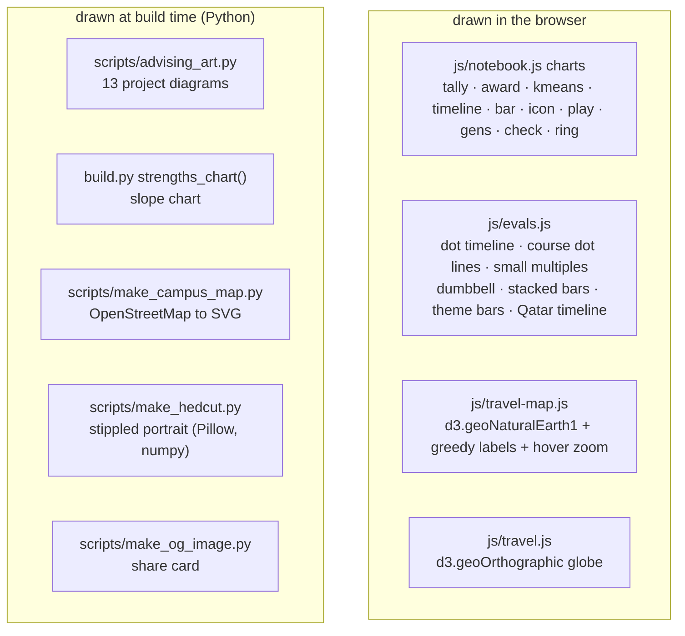
```mermaid
flowchart TB
  subgraph runtime["drawn in the browser"]
    nb["js/notebook.js charts<br/>tally · award · kmeans · timeline · bar · icon · play · gens · check · ring"]
    ev["js/evals.js<br/>dot timeline · course dot lines · small multiples<br/>dumbbell · stacked bars · theme bars · Qatar timeline"]
    tm["js/travel-map.js<br/>d3.geoNaturalEarth1 + greedy labels + hover zoom"]
    tg["js/travel.js<br/>d3.geoOrthographic globe"]
  end
  subgraph buildtime["drawn at build time (Python)"]
    aa["scripts/advising_art.py<br/>13 project diagrams"]
    sc["build.py strengths_chart()<br/>slope chart"]
    cm["scripts/make_campus_map.py<br/>OpenStreetMap to SVG"]
    hc["scripts/make_hedcut.py<br/>stippled portrait (Pillow, numpy)"]
    og["scripts/make_og_image.py<br/>share card"]
  end
```

| Chart | Where | Code |
|---|---|---|
| Tally marks (home stats) | `/` | `charts.tally`, `js/notebook.js:164` |
| k-means sketch with centroids | `/` | `charts.kmeans`, `js/notebook.js:191` |
| Career timeline | `/`, `/cv/` | `charts.timeline`, `js/notebook.js:221` |
| Hatched bar chart | course pages (project types) | `charts.bar`, `js/notebook.js:250` |
| Course doodles (net, scatter, bell curve, gradient descent...) | course cards | `charts.icon`, `js/notebook.js` |
| Every evaluation, term by term (dot plot sized by n, weighted mean line) | `/evaluations/` | `timeline()`, `js/evals.js:121` |
| Course by course (dot lines, circled mean) | `/evaluations/` | `courses()`, `js/evals.js:175` |
| Small multiples for repeat courses | `/evaluations/` | `multiples()`, `js/evals.js:211` |
| First year against latest, nine items (dumbbell) | `/evaluations/` | `dumbbell()`, `js/evals.js:244` |
| Share of "excellent" ratings (100% stacked bars) | `/evaluations/` | `excellent()`, `js/evals.js:268` |
| Comment themes (hatched bars) | `/evaluations/` | `themes()`, `js/evals.js:301` |
| World map, US cities, photo pop-ups | `/travel/` | `js/travel-map.js` |
| Globe | `/travel/` | `js/travel.js` |
| StrengthsFinder slope chart | `/strengths/` | `strengths_chart()`, `scripts/build.py:2508` |
| Advising project diagrams | `/advising/` | `scripts/advising_art.py` |
| Campus map | `/cv/`, `/contact/` | `scripts/make_campus_map.py` |

**Design rules the charts follow:**

- **Zero baseline, always.** Every rating axis starts at 0, even though the evaluation scale runs from 1 to 5, and the axes name each point in the survey's own words (1 poor, 2 below average, 3 average, 4 above average, 5 excellent).
- **Colourblind-checked palette.** Programs are coded MBA blue `#2447a6`, MS in Business Analytics red `#b8352a`, undergraduate purple `#6b3fa0`, Heinz amber `#c47a12`. The order was chosen by running a colour-vision-deficiency validator and keeping the arrangement with the largest minimum difference between neighbours.
- **No colour-only encoding.** Every mark has a tooltip (a sticky note) that works on hover, tap and keyboard focus, and the timeline has a table twin.
- **Weighted, labelled, honest.** Means are response-weighted; dots are sized by responses so small sections read as small; the caption says what the axis is.

---

## Code worth sharing with students

Small, self-contained pieces that make good teaching examples. None needs anything beyond a browser or the Python standard library.

| Idea | Where | Why it is a good example |
|---|---|---|
| A seeded random number generator in 8 lines | `js/notebook.js:20` | Reproducibility: the same seed gives the same "random" drawing every time |
| Hand-drawn lines from cubic Béziers | `lineD`, `js/notebook.js:40` | Shows how control points shape a curve; jitter makes it look human |
| The stroke-dashoffset drawing trick | `ink()` and `measure()`, `js/notebook.js:86-102`, plus `.ink` in `css/site.css` | The standard technique behind "self-drawing" SVG, in about 20 lines |
| A dot plot sized by sample size, with a weighted mean line | `timeline()`, `js/evals.js:121` | Encoding n visually; why weighted means differ from simple means |
| A dumbbell chart | `dumbbell()`, `js/evals.js:244` | Before and after for many items on one axis |
| Small multiples on a shared scale | `multiples()`, `js/evals.js:211` | One chart per group, same axes, comparable at a glance |
| Greedy label placement without overlaps | `placeLabels()`, `js/travel-map.js:104` | A real-world collision problem solved with bounding boxes and a priority order |
| A slope chart in plain Python that writes SVG | `strengths_chart()`, `scripts/build.py:2508` | Rank change between two snapshots, no plotting library |
| OpenStreetMap to SVG | `scripts/make_campus_map.py` | Projecting lat/lon to a page and drawing buildings and roads |
| Stippling a photo with Pillow and numpy | `scripts/make_hedcut.py` | Image processing as data: brightness becomes dot density |
| Cache-busting by content hash | `versioned()`, `scripts/build.py:683` | Why "it works on my machine" happens with caches, fixed in 15 lines |

---

## The robot

A small robot, drawn with the same pen, visits **three times per browsing session**. Its clock starts on the first page of a visit (`sessionStorage`), so moving between pages does not restart it, and each visit happens once.

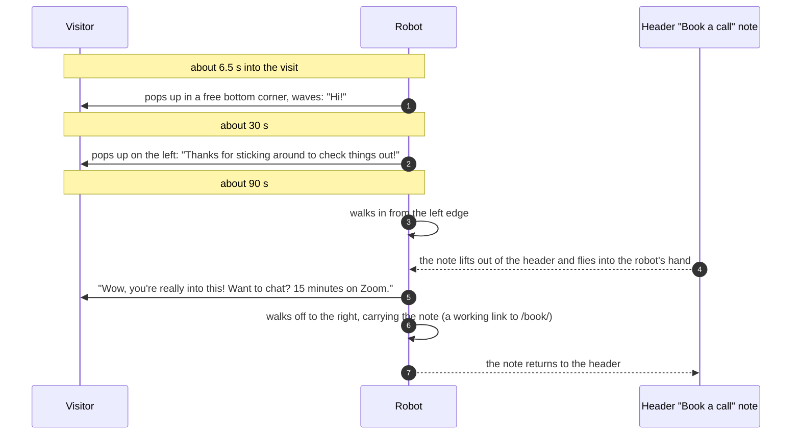
```mermaid
sequenceDiagram
  autonumber
  participant V as Visitor
  participant R as Robot
  participant H as Header "Book a call" note
  Note over V,R: about 6.5 s into the visit
  R->>V: pops up in a free bottom corner, waves: "Hi!"
  Note over V,R: about 30 s
  R->>V: pops up on the left: "Thanks for sticking around to check things out!"
  Note over V,R: about 90 s
  R->>R: walks in from the left edge
  H-->>R: the note lifts out of the header and flies into the robot's hand
  R->>V: "Wow, you're really into this! Want to chat? 15 minutes on Zoom."
  R->>R: walks off to the right, carrying the note (a working link to /book/)
  R-->>H: the note returns to the header
```

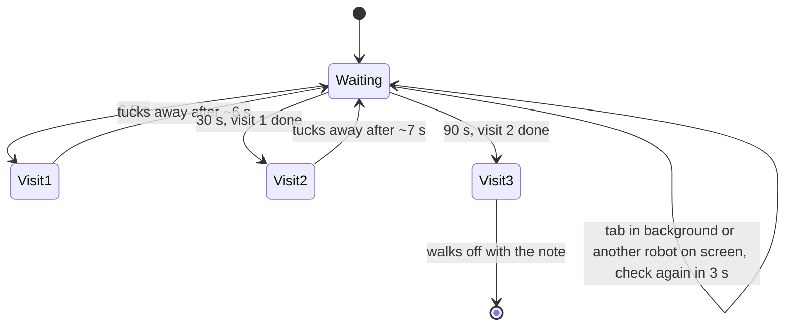
```mermaid
stateDiagram-v2
  [*] --> Waiting
  Waiting --> Visit1: 6.5 s
  Visit1 --> Waiting: tucks away after ~6 s
  Waiting --> Visit2: 30 s, visit 1 done
  Visit2 --> Waiting: tucks away after ~7 s
  Waiting --> Visit3: 90 s, visit 2 done
  Visit3 --> [*]: walks off with the note
  Waiting --> Waiting: tab in background or another robot on screen, check again in 3 s
```

How it behaves:

- **Code:** `makeBot()` draws it (`js/notebook.js:519`); `peek()` handles visits 1 and 2; `walkWithBanner()` (`:600`) handles visit 3; `robot()` (`:644`) runs the schedule.
- **Placement:** visits 1 and 2 choose a bottom corner that does not cover the nav or any button, link card or sticky note. If both corners are busy they wait and try again.
- **Clicking:** a click on the robot makes it hop and wave again. Only visit 3 offers anything, and only after a visitor has spent a minute and a half on the site.
- **When it stays home:** never two robots at once, never in a background tab, never on `/book/` (visit 3), and never with reduced motion.

---

## The reels

The whole story, from the first question to the encoded video, with diagrams and the edit timeline: **[docs/reels-pipeline.md](docs/reels-pipeline.md)**.

`/reels/` plays two short slideshows of Ben's face over the years, made from his Apple Photos library by `scripts/make_reels.py`. The script runs on Ben's Mac only. It reads the library through osxphotos, read-only, and does every check locally: no photo is sent to any online service, and the only copies that leave the Mac are the exported WebP files committed here.

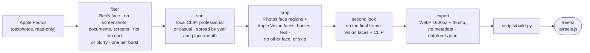
```mermaid
flowchart LR
  photos["Apple Photos<br/>(osxphotos, read-only)"] --> filter["filter<br/>Ben's face · no screenshots,<br/>documents, screens · not too dark<br/>or blurry · one per burst"]
  filter --> sort["sort<br/>local CLIP: professional<br/>or casual · spread by year<br/>and place-month"]
  sort --> crop["crop<br/>Photos face regions +<br/>Apple Vision faces, bodies, text ·<br/>no other face, or skip"]
  crop --> check["second look<br/>on the final frame:<br/>Vision faces + CLIP"]
  check --> export["export<br/>WebP 1600px + thumb,<br/>no metadata · data/reels.json"]
  export --> build["scripts/build.py"]
  build --> page(["/reels/<br/>js/reels.js"])
```

```bash
# needs osxphotos, open_clip_torch, torch, pillow, pillow-heif, numpy,
# pyobjc-framework-Vision and pyobjc-framework-Quartz
python scripts/make_reels.py --per-reel 150 --dry-run   # list the picks, write nothing
python scripts/make_reels.py --per-reel 150             # write assets/reels/ and data/reels.json
python3 scripts/build.py
```

- **Who.** Only photos where Photos has tagged Ben ("Benjamin Collier") as a face.
- **Dropped.** Screenshots, videos, hidden photos, documents, receipts and screens (by Photos labels and CLIP), graphics and posters, very dark or very blurry shots, and all but the best photo of any series taken within a minute.
- **Other people.** Each original is checked with Photos' face regions and Apple Vision (faces, whole and upper bodies). The script looks for a 4:5 or 16:9 frame at least 1080px tall that holds Ben's face and no part of anyone else's. If there is none, the photo is skipped, always so for a child. A second, independent pass runs Vision's newer face model and a local CLIP "more than one person" vote on the exact frame being published. Nothing is ever blurred.
- **Home.** Photos taken at home are kept, labelled only "Pittsburgh", and any that shows a house or street number (Vision text recognition) is dropped.
- **Places** are coarse: a well-known city, otherwise a US state or a country. Photos with no location borrow the place of the nearest located photo within 36 hours.
- **Hand review.** Every exported image is checked by eye. `scripts/reels_overrides.json` maps a Photos UUID to `"skip"`, `"pro"` or `"casual"`; it holds no images or names. To pull a published photo without the library at hand, list its file name (`"casual/021"`) in `scripts/reels_removed.json`; the next run turns it into a `"skip"` using the private manifest.
- **Deterministic.** The same library and overrides give the same picks in the same order. CLIP scores are cached in `~/Library/Caches/ben-reels/`, which also holds the private report (counts per year and place, and what was skipped and why) and the file-to-UUID manifest. None of that is committed.

The professional reel is short because the library has few genuinely professional photos of Ben alone; the script does not pad it with casual ones.

Version 1 is tagged `reels-v1` in git.

### Version 2: the music video

Version 2 recuts the exact version 1 photos as a 3:41 music video. It takes nothing new from the Photos library. The only other images are 48 place photos already published on `/travel/`, each checked by Apple Vision and by eye to have nobody in it (`scripts/reels_v2_broll.json`).

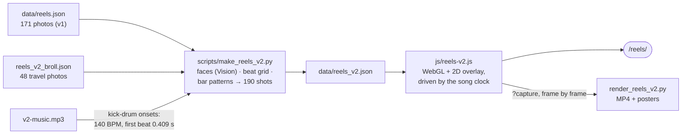
```mermaid
flowchart LR
  v1["data/reels.json<br/>171 photos (v1)"] --> dir
  broll["reels_v2_broll.json<br/>48 travel photos"] --> dir
  music["v2-music.mp3"] -->|kick-drum onsets:<br/>140 BPM, first beat 0.409 s| dir
  dir["scripts/make_reels_v2.py<br/>faces (Vision) · beat grid ·<br/>bar patterns → 190 shots"] --> json["data/reels_v2.json"]
  json --> player["js/reels-v2.js<br/>WebGL + 2D overlay,<br/>driven by the song clock"]
  player --> page(["/reels/"])
  player -->|?capture, frame by frame| mp4["render_reels_v2.py<br/>MP4 + posters"]
```

- **Direction.** The track is laid out as sections on its beat grid (bars start on beats 2, 6, 10 ...): cold open with a seal drawing itself (0:00), glitch-in title (0:08), 24 places at two beats each (0:15), Professional Ben speeding from two beats to a half beat into a white-out (0:35), drop one with "CASUAL BEN" (0:54), breakdown (2:03), rebuild and riser (2:16), drop two with "STILL BEN" (2:30), and a closing mosaic of all 171 photos (3:11).
- **Bar patterns.** Each bar is one letter in `make_reels_v2.py`: `H` four one-beat hits, `h` two punched two-beat holds, `S` framed slow pushes, `G` a 2x2 grid landing one cell a beat, `P` triple colour panels, `B` neon b-roll, `K` a kaleidoscope of the busiest place photos, `X` glitch, `R` a riser. `fit()` trades `H` for `h` until every casual photo appears exactly once, oldest to newest.
- **Renderer.** One fragment shader handles crop-toward-face, push and punch zooms, colour split, glitch blocks, two-tone grades, zoom blur, framed shots over their own blurred glow, grids, panels and the kaleidoscope. A 2D canvas on top draws the type (Black Han Sans), the seal with Ben's name in hangul, stage-light beams, sparkles, drop shockwaves, place chips and the mosaic. Every frame is a pure function of the song time, so seeking is exact and `?capture` renders a video file.
- **Safety.** With `prefers-reduced-motion` the same cut plays with no flashes, colour split, glitch, shake, zoom punches or spin. Full-screen flashes happen only at the two drops and the two white-outs, well under three a second.
- **Music.** Kept under 4 MB, starts only on play, and the audio element is the master clock. Seeking needs HTTP range requests, which GitHub Pages serves; `python3 -m http.server` does not, so seek locally with a range-capable server.

### Video storage: Cloudflare R2

The page draws version 2 live, so no video file is needed to watch it. Rendered MP4s, for sharing or for a future reels app, live in a Cloudflare R2 bucket, `ben-reels`, kept inside R2's free tier: 10 GB stored, 1 million writes (Class A) and 10 million reads (Class B) a month, with no charge for downloads.

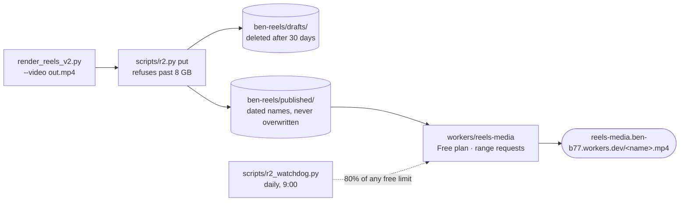
```mermaid
flowchart LR
  render["render_reels_v2.py<br/>--video out.mp4"] --> put["scripts/r2.py put<br/>refuses past 8 GB"]
  put --> drafts[("ben-reels/drafts/<br/>deleted after 30 days")]
  put --> pub[("ben-reels/published/<br/>dated names, never overwritten")]
  pub --> worker["workers/reels-media<br/>Free plan · range requests"]
  worker --> url(["reels-media.ben-b77.workers.dev/&lt;name&gt;.mp4"])
  watch["scripts/r2_watchdog.py<br/>daily, 9:00"] -. "80% of any free limit" .-> worker
```

```bash
python3 scripts/r2.py usage                                            # bytes stored vs the 8 GB cap
python3 scripts/r2.py put out.mp4 drafts/reels-v2-2026-10-05.mp4       # private, auto-deleted in 30 days
python3 scripts/r2.py put out.mp4 published/reels-v2-2026-10-05.mp4    # public at the Worker URL
python3 scripts/r2_watchdog.py --dry-run                               # this month's use vs the free tier
cd workers/reels-media && npx wrangler@4 deploy                        # deploy, or turn the Worker back on
```

How it stays free, since Cloudflare has no hard spending cap:

| Charge | Who can cause it | Guard |
|---|---|---|
| Storage over 10 GB | only these scripts | `r2.py` refuses any upload past 8 GB; `drafts/` empties itself after 30 days |
| Class A (writes, lists) over 1 million | only these scripts | the upload keys reach this one bucket and live only on Ben's Mac mini |
| Class B (reads) over 10 million | visitors | the bucket has no public or `r2.dev` access; reads go through the Worker, and the Workers **Free** plan stops at 100,000 requests a day instead of billing (at most 3 million a month) |
| Anything | anyone | Cloudflare e-mails Ben at $1 of spend and at 80% of each free amount; `r2_watchdog.py` (run daily by `scripts/launchd/phd.collier.r2-watchdog.plist`) switches the Worker's address off at 80% |

Credentials are in `~/.config/r2/reels.env` on the Mac mini (mode 600): `R2_ACCOUNT_ID`, `R2_ACCESS_KEY_ID` and `R2_SECRET_ACCESS_KEY` (an R2 token limited to `ben-reels`), and `CLOUDFLARE_API_TOKEN` (Workers R2 Storage and Workers Scripts edit, for deploys and the watchdog). They are never in the repo. Wrangler reads the token from the environment: `set -a; . ~/.config/r2/reels.env; set +a; export CLOUDFLARE_ACCOUNT_ID=$R2_ACCOUNT_ID`.

---

## Where the data comes from

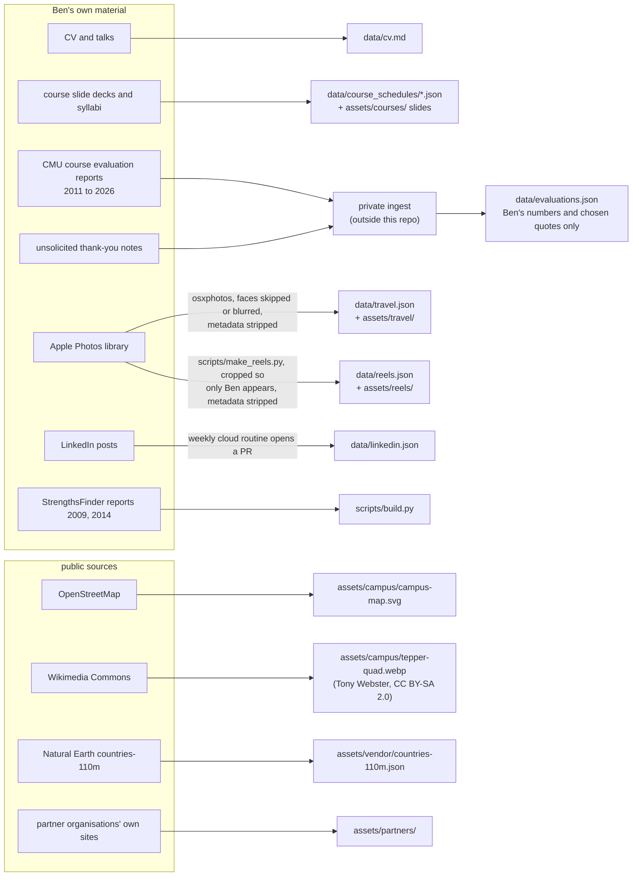
```mermaid
flowchart LR
  subgraph ben["Ben's own material"]
    cvsrc["CV and talks"]
    decks["course slide decks and syllabi"]
    fce["CMU course evaluation reports<br/>2011 to 2026"]
    notes["unsolicited thank-you notes"]
    photos["Apple Photos library"]
    linkedin["LinkedIn posts"]
    sf["StrengthsFinder reports 2009, 2014"]
  end
  subgraph public["public sources"]
    osm["OpenStreetMap"]
    ne["Natural Earth countries-110m"]
    logos["partner organisations' own sites"]
    wiki["Wikimedia Commons"]
  end
  cvsrc --> cvmd["data/cv.md"]
  decks --> schedjson["data/course_schedules/*.json<br/>+ assets/courses/ slides"]
  fce --> ingest["private ingest<br/>(outside this repo)"]
  notes --> ingest
  ingest --> evaljson["data/evaluations.json<br/>Ben's numbers and chosen quotes only"]
  photos -->|osxphotos, faces skipped or blurred,<br/>metadata stripped| traveljson["data/travel.json<br/>+ assets/travel/"]
  photos -->|scripts/make_reels.py, cropped so<br/>only Ben appears, metadata stripped| reelsjson["data/reels.json<br/>+ assets/reels/"]
  linkedin -->|weekly cloud routine opens a PR| lijson["data/linkedin.json"]
  sf --> buildpy["scripts/build.py"]
  osm --> campus["assets/campus/campus-map.svg"]
  wiki --> campus2["assets/campus/tepper-quad.webp<br/>(Tony Webster, CC BY-SA 2.0)"]
  ne --> vendor["assets/vendor/countries-110m.json"]
  logos --> partners["assets/partners/"]
```

| Data | File | Source and process |
|---|---|---|
| CV | `data/cv.md` | Ben's CV, edited by hand |
| Courses, schedules, slides | `data/course_schedules/*.json`, `assets/courses/<slug>/` | Ben's own decks; five slides per session as 1280x720 WebP plus 320px thumbnails; student work excluded |
| Course list, news | `COURSES`, `NEWS` in `scripts/build.py` | Hand-written |
| Evaluations | `data/evaluations.json`, `evaluations-a/` | `/evaluations/` compares two independently authored reports. Version A is the GPT-5.6 Sol High full-history story (44 sections, 1,157 responses, 2011 to 2026). Version B is generated from `data/evaluations.json` and leads with 24 recent CMU sections (727 responses), with the 2012 to 2016 Qatar record shown separately. The public files contain only Ben's own numbers and anonymous excerpts. No school comparison averages, colleague data, or names are published. |
| Advising | `data/advising.json`, `assets/partners/` | Project descriptions without student names; partner logos from each organisation's own site |
| Travel | `data/travel.json`, `assets/travel/` | Ben's Apple Photos library read with osxphotos: 27 countries and 55 US cities (suburbs merged into their city). Photos with other people's faces were skipped or blurred, all metadata and GPS stripped, dots placed on official city centres, nothing near home |
| Reels | `data/reels.json`, `assets/reels/` | `scripts/make_reels.py` (see [The reels](#the-reels)). Ordered list of `{src, w, h, place}` per reel; no dates, coordinates or names |
| Reels v2 edit | `data/reels_v2.json`, `assets/reels/v2-poster*.webp` | `scripts/make_reels_v2.py` from `data/reels.json`, `scripts/reels_v2_broll.json` and the track's beat grid; posters by `scripts/render_reels_v2.py` |
| Reels v2 music | `assets/reels/v2-music.mp3`, `assets/reels/v2-music.json` | "High Technologic Beat Explosion" by Loyalty Freak Music, from *Robot Dance!*, CC0 1.0, via the [Internet Archive](https://archive.org/details/LoyaltyFreakMusicROBOTDANCE2017113032423755). Loudness-normalised, 128 kbps |
| Reels music | `assets/reels/music.mp3`, `assets/reels/music.json` | "Juillet" by Monplaisir, fingerstyle folk guitar from *Bonjour from Paris, Nantes and Montreal*, CC0 1.0, via the [Internet Archive](https://archive.org/details/MonplaisirBonjourFromParisNantesAndMontreal). Loudness-normalised, metadata stripped |
| LinkedIn | `data/linkedin.json` | A weekly cloud routine reads Ben's public profile and opens a pull request with any new posts; Ben approves it. Read in the browser, so no rebuild |
| Campus map | `assets/campus/campus-map.svg` | OpenStreetMap extract (ODbL), drawn by `scripts/make_campus_map.py` |
| World shapes | `assets/vendor/countries-110m.json` | Natural Earth via world-atlas |
| Portrait hedcut | `assets/portrait-hedcut.png` | `scripts/make_hedcut.py` from `assets/portrait.jpg` |
| Share card | `assets/og.png` | `scripts/make_og_image.py` |

---

## Analytics

Google Analytics 4, switched on by `ga4_id` in `data/site.json` (empty means no tag on any page). `build.py` writes `js/analytics.js` into every page's head, and that file loads Google's tag.

| What | Where in GA4 |
|---|---|
| Pages people read, and time on each (engagement time) | Reports, Engagement, Pages and screens |
| Where visitors come from (search, LinkedIn, links, direct) | Reports, Acquisition, Traffic acquisition |
| Country and city, device, browser | Reports, User attributes and Tech |
| Scroll depth, outbound links, PDF downloads | GA4 enhanced measurement, built in |
| Every link and button pressed: nav tabs, Book a call, reel play, the robot's note | the `ui_click` event, with `click_label` (what it said) and `click_area` (nav tab, book a call (header), reels player, robot, footer, or the section id) |

`click_label` and `click_area` show up in reports once they are registered as event-scoped custom dimensions (Admin, Custom definitions). Ben's own visits stay out after opening any page once with `?notrack`; `?track` undoes it. A cookie-free second count with Cloudflare Web Analytics is on the [roadmap](docs/ROADMAP.md).

## Domains and deployment

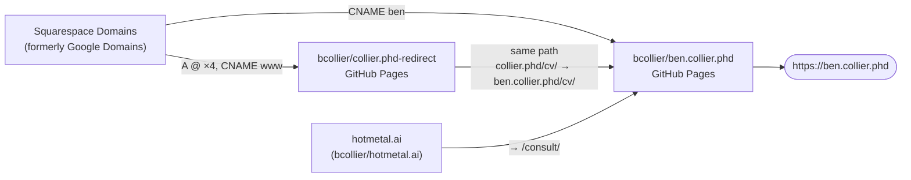
```mermaid
flowchart LR
  dns["Squarespace Domains<br/>(formerly Google Domains)"]
  dns -->|"CNAME ben"| main["bcollier/ben.collier.phd<br/>GitHub Pages"]
  dns -->|"A @ ×4, CNAME www"| redir["bcollier/collier.phd-redirect<br/>GitHub Pages"]
  redir -->|"same path<br/>collier.phd/cv/ → ben.collier.phd/cv/"| main
  hm["hotmetal.ai<br/>(bcollier/hotmetal.ai)"] -->|"→ /consult/"| main
  main --> site(["https://ben.collier.phd"])
```

- **DNS** for `collier.phd` is at Squarespace Domains (the old Google Domains, so the name servers are still `ns-cloud-e*.googledomains.com`).
  - `@`: GitHub's four A records (185.199.108-111.153).
  - `www` and `ben`: CNAMEs to `bcollier.github.io`.
  - The MX records for Google Workspace email are untouched.
- **`CNAME`** in this repo holds `ben.collier.phd`. **`data/site.json`** is the single source for absolute URLs (canonical, Open Graph, sitemap, feed).
- The **redirect repo** serves `collier.phd` and `www.collier.phd`. Its `index.html` and `404.html` send every path to the same path here.
- HTTPS is enforced on all three Pages sites.

**Workflow** (from `AGENTS.md`): never commit to `main`; branch, open a PR, squash-merge, delete the branch, pull. Run the build before committing any change to `data/` or `scripts/`.

---

## Working on the site

```bash
python3 scripts/build.py                     # regenerate every page
python3 -m http.server 8000                  # preview at http://localhost:8000
```

| To change | Edit | Rebuild? |
|---|---|---|
| CV | `data/cv.md` | Yes |
| Courses, news | `COURSES` / `NEWS` in `scripts/build.py` | Yes |
| A course's schedule, slides, projects | `data/course_schedules/<slug>.json`, `assets/courses/<slug>/` | Yes |
| Evaluations and quotes | regenerate `data/evaluations.json` from the private ingest | Yes |
| Advising projects | `data/advising.json` | Yes |
| Travel | `data/travel.json`, `assets/travel/` | Yes |
| Reels | rerun `scripts/make_reels.py`; hand fixes in `scripts/reels_overrides.json` | Yes |
| Reels v2 | rerun `scripts/make_reels_v2.py` after any v1 change; `scripts/render_reels_v2.py --posters` | Yes |
| Domain, name, links | `data/site.json` | Yes |
| LinkedIn posts | `data/linkedin.json` or `scripts/add_linkedin_post.py` | No |
| Booking links (Cal.com, Calendly) | `js/config.js` | No |
| Styles | `css/site.css` | Yes (so the version hash updates) |
| Scripts | `js/*.js` | Yes (same reason) |

Other scripts: `add_linkedin_post.py` (add a post by hand), `fetch_linkedin_photo.py` (student headshots, with permission), `make_hedcut.py`, `make_campus_map.py`, `make_og_image.py`. All except the last three use only the standard library.

---

## Privacy rules

- **Analytics.** Google Analytics 4 only, with ad features and Google signals off, and a footer note on every page saying so. It is not loaded on localhost, in headless renders, or in a browser that has opened any page with `?notrack`.
- **Students.** No student names, photos or projects without explicit permission. Capstones are described without names, final-project lists are anonymised, and evaluation quotes carry only the term.
- **Colleagues.** No other instructor's ratings or comparison numbers appear anywhere on the site.
- **Photos.** Faces other than Ben's are excluded or blurred, and every photo is re-encoded without metadata. The reels never blur: a photo with anyone else in it is cropped until they are gone, or left out.
- **Email.** The personal address never appears in the HTML; `js/site.js` assembles it in the browser.
- **Copy.** Public copy is written in Ben's voice, with no em dashes and no instructions to editors rendered into pages (see `AGENTS.md`).

---

## History: 15-113 and the six designs

The site began as Project 1 for 15-113. That version is frozen as the [`cs15-113-submission`](https://github.com/bcollier/ben.collier.phd/releases/tag/cs15-113-submission) tag. The six design directions from that project still live in [`designs/`](designs/), and the logs of the two AI-assisted build sessions are kept as they were:

| Document | What it covers |
|---|---|
| [`cursor-ai-code-assistance-chat-history.md`](cursor-ai-code-assistance-chat-history.md) | The first session (Cursor, 30 August 2026): a correct, deployable multi-page site |
| [`claude-code-chat-history.md`](claude-code-chat-history.md) | The second session (Claude Code, 5 September 2026): six finished design directions |
| [`PROMPTS.md`](PROMPTS.md) | The reflective prompt log for the assignment |

The Field Notebook revision described above grew out of design 04, "Notebook", and was built with Claude Code across September and October 2026, one pull request per change (see the repo's closed PRs for the full trail).
