# How the reels were made

The two reels on [ben.collier.phd/reels](https://ben.collier.phd/reels/) were made entirely by AI. Ben asked for them in plain English, and Claude Code (Anthropic's coding agent) did everything else: it wrote the brief, read the photo library, chose the photos, cropped out other people, sorted the work shots from the rest, wrote the slideshow player, directed a beat-cut music video, rendered it to a video file and published the page. Ben wrote no code. His part was the request, a few rounds of "change this", and the final say.

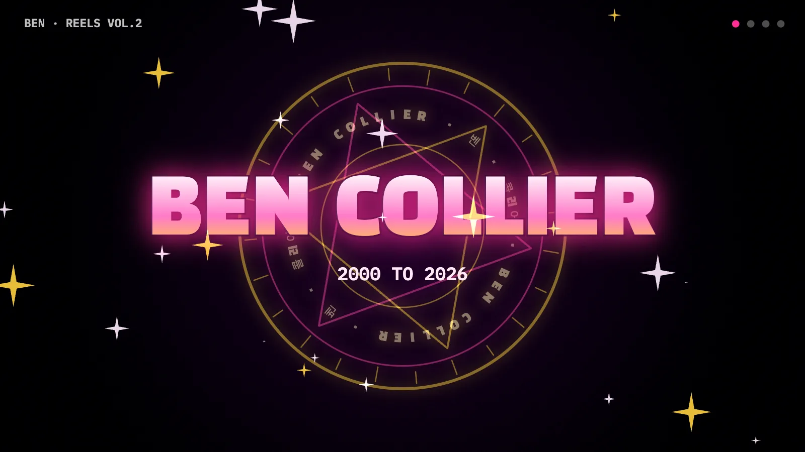

| | |
|---|---|
| Version 1 | Two slideshows: **Professional Ben** (22 photos) and **Casual Ben** (149 photos), 2000 to 2026, 29 places |
| Version 2 | A 3:41 music video of the same 171 photos plus 48 place shots, cut to a 140 BPM track: 190 shots |
| Made with | Claude Code, two sessions on two Macs |
| Code | `scripts/make_reels.py`, `scripts/make_reels_v2.py`, `scripts/render_reels_v2.py`, `js/reels.js`, `js/reels-v2.js` |
| Rerun | Any time, on Ben's Mac: the same library gives the same reels |

---

## 1. From the question to the published video

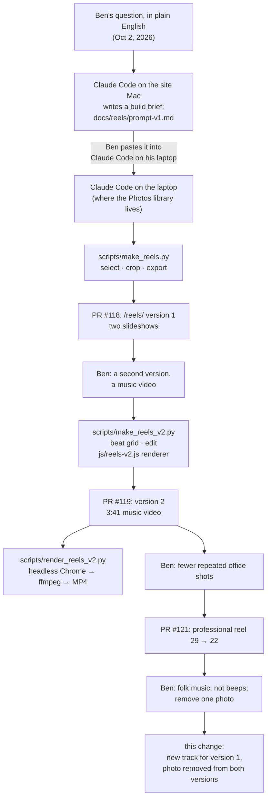

**The question**, exactly as Ben typed it:

> I want a page that does the following (1) go through my apple photos, search for face pictures of Ben like attached and go through the pictures until you have roughly 150 pictures of my face from different geographic locations and times going back as far as the library starts. then the web page would play an animation of all those images in a movie style format and play simple free open source music in the background. it would be an added bonus if there were two videos. one professoinal Ben with fancier photos and the other casual Ben with travel and relaxed family pictures. prefer pictures without other people's faces or find way to crop the image so others faces are not show. this should be an automated pipeline so I can run this script any time and it roughly builds the animated movie. show text of the location in the world (Pittsburgh, Thailand, etc) the image was taken in, but strip out all other data about the image when posting ot the web or anywhere public.

**The brief** Claude wrote from it, which became the laptop session's instructions: [docs/reels/prompt-v1.md](reels/prompt-v1.md). It turned the request into seven checkable steps: find Ben, pick about 150 per reel spread over years and places, crop out everyone else or skip, export without metadata, build the page, make it a rerunnable script, then check by eye and ship. It also added a few rules of its own: nothing near home, no blurred faces, sound only on play, and reduced motion respected.

**Why two sessions.** The site lives on one Mac. macOS does not let a terminal app read someone's Photos library without Full Disk Access, and the library is on Ben's laptop. So the session that knew the site wrote the brief, and a second session on the laptop did the photo work. Everything met in the same GitHub repo, one pull request per step.

---

## 2. Version 1: choosing and cropping the photos

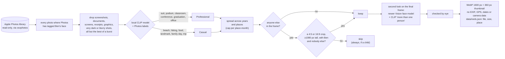

What happened to the candidates on the first run:

| Step | Photos |
|---|---:|
| Skipped because another person could not be cropped out (200 with a child, 134 with an adult, 4 caught by the second look) | 338 |
| Removed on review by eye (other people, a mis-tagged face, sideways, shirtless, a house number) | 58 |
| Published at first (PR #118) | 179 |
| Repeated office shots cut on Ben's request (PR #121) | 7 |
| Removed on Ben's request (this change) | 1 |
| **In the reels now** | **171** |

**How "professional" is decided.** Each photo is scored locally by CLIP, an image model that compares a picture with short text descriptions, against prompts such as "a man in a suit and tie", "a speaker giving a talk at a podium", "a professor teaching a class" and "a university graduation ceremony". The casual prompts are things like "a man hiking outdoors", "a tourist in front of a landmark" and "a family day at the park". Photos' own scene labels (Suit, Necktie, Conference, Classroom, Podium, Graduation...) add to the score. A photo counts as professional only on a strong match, so the professional reel stays short rather than padded.

**How other people are kept out.** Photos' face regions and Apple Vision's face and body detectors find everyone in the original. `find_crop()` in `make_reels.py` then searches 4:5 and 16:9 frames from large to small, sliding each across the photo, for the biggest one that holds Ben's face with room around it and touches nobody else. If no such frame exists, the photo is left out. Nothing is ever blurred.

**Where the photos are from.** The only label shown is a coarse place: a well-known city, otherwise a US state or a country. No coordinates or dates are kept.

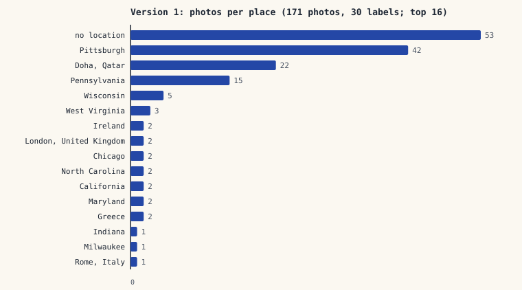

A few of the published frames:

<p>

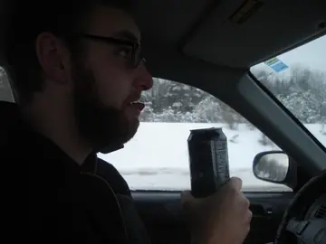
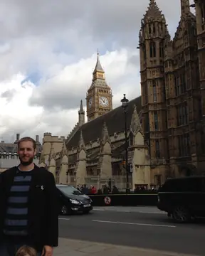
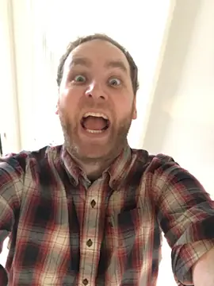
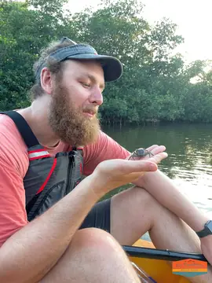
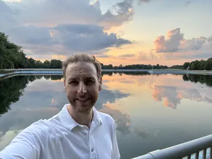
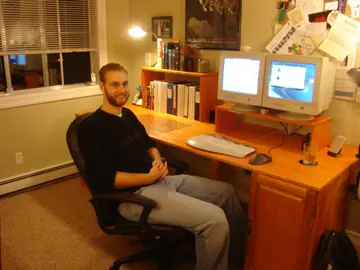

</p>

**The slideshow player** (`js/reels.js`) shows each photo for about 1.2 seconds with a slow pan and zoom and a 0.35-second crossfade, puts the place on a taped label in Kalam handwriting, preloads four photos ahead, and pauses when the tab is hidden. Music plays only after the visitor presses play.

---

## 3. Version 2: the music video

Version 2 reuses the version 1 photos and takes nothing new from the library. Its only other images are 48 place photos already public on [/travel/](https://ben.collier.phd/travel/), each checked to have nobody in it.

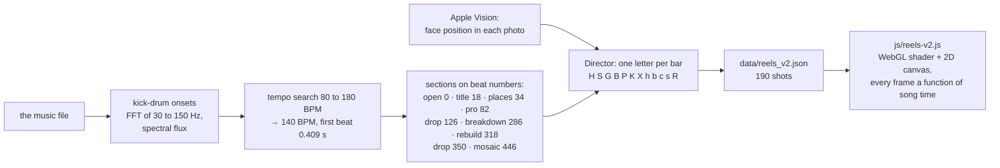

**Finding the beat.** `beat_grid()` in `make_reels_v2.py` decodes the track, takes the low-frequency energy of each short window (where the kick drum lives), measures how sharply it rises, and tries every tempo from 80 to 180 BPM at every starting offset, keeping the one whose beats land on the most kicks. For this track: 140 BPM, first beat at 0.409 seconds, drops at 0:54 and 2:30.

**Directing.** Each section is a string of letters, one per bar of four beats. `H` is four one-beat hits with a zoom punch, `S` two framed slow pushes, `G` a 2x2 grid landing one cell a beat, `P` triple colour panels, `B` neon b-roll, `K` a kaleidoscope, `X` glitch, `R` a riser into white. The first drop is `HSGBHPKX` repeated. `fit()` swaps `H` for `h` until every casual photo appears exactly once, oldest to newest.

Every one of the 190 shots, on the song's timeline:

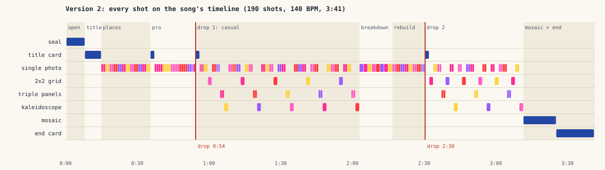

**Drawing it.** `js/reels-v2.js` draws each frame live in the browser. One WebGL fragment shader does the photo work: crop toward the face, push and punch zooms, colour split, glitch blocks, two-tone grades, zoom blur, grids, panels and the kaleidoscope. A 2D canvas on top adds the titles, a seal with Ben's name, stage-light beams, sparkles and the closing mosaic. Because every frame depends only on the song time, seeking is exact. With reduced motion turned on, the same cut plays without flashes, glitch, shake or spin.

---

## 4. From the page to an encoded video file

The page draws the video live, so a video file is made by filming the page, frame by frame.

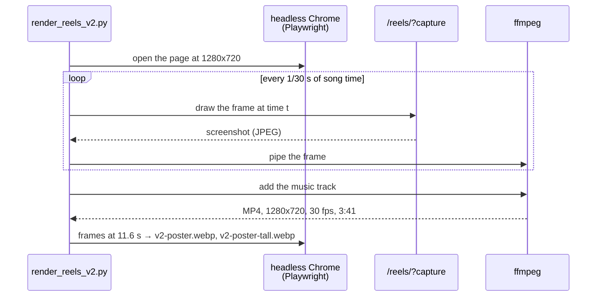

The MP4 is for sharing by hand and is not committed, since it is too big for the repo. The two poster images on the page come from the same renderer.

---

## 5. Privacy

- **Local only.** The library was opened read-only. CLIP and Apple Vision ran on the Mac, and no photo was sent to any online service.
- **No metadata.** Every published image is a fresh pixel-only WebP: no EXIF, XMP, ICC profile, GPS, dates or camera data. File names are just numbers.
- **What the data file holds.** `data/reels.json` holds, for each photo, the file, its size and a coarse place. Nothing else.
- **Other people.** Nobody else's face appears. Photos that couldn't be cropped clean were left out, and every published frame was checked by eye.
- **What stays on Ben's Mac.** The file-to-photo manifest, the cached model scores and the run report stay in `~/Library/Caches/ben-reels/`. To pull a published photo later, list its file name in `scripts/reels_removed.json`; the next run turns it into a permanent skip.

---

## 6. Tools

| Tool | Used for |
|---|---|
| Claude Code (Anthropic) | Everything: the brief, all code, selection, review, the edit, rendering, the pull requests |
| [osxphotos](https://github.com/RhetTbull/osxphotos) | Reading the Apple Photos library, faces, labels and places, read-only |
| Apple Vision (via pyobjc) | Finding faces, bodies and text on the Mac |
| [OpenCLIP](https://github.com/mlfoundations/open_clip) + PyTorch | Professional or casual, screens and graphics, "more than one person" |
| Pillow, pillow-heif, numpy | Opening originals, cropping, exporting WebP without metadata, beat analysis |
| WebGL and Canvas 2D | Drawing version 2 live in the browser |
| Playwright + headless Chrome, ffmpeg | Rendering version 2 to MP4 and posters |
| GitHub Pages | Hosting |

## 7. Music

- **Version 1:** "Juillet" by Monplaisir, fingerstyle folk guitar from *Bonjour from Paris, Nantes and Montreal*, [CC0 1.0](https://creativecommons.org/publicdomain/zero/1.0/), via the [Internet Archive](https://archive.org/details/MonplaisirBonjourFromParisNantesAndMontreal). It replaced Komiku's "Travel to the Horizon" after Ben asked for something warmer and more acoustic.
- **Version 2:** "High Technologic Beat Explosion" by Loyalty Freak Music, from *Robot Dance!*, [CC0 1.0](https://creativecommons.org/publicdomain/zero/1.0/), via the [Internet Archive](https://archive.org/details/LoyaltyFreakMusicROBOTDANCE2017113032423755).

## 8. Run it again

On Ben's Mac, with the Python packages listed at the top of `scripts/make_reels.py`:

```bash
python scripts/make_reels.py --per-reel 150 --dry-run   # list the picks, write nothing
python scripts/make_reels.py --per-reel 150             # assets/reels/ and data/reels.json
python scripts/make_reels_v2.py                         # re-cut version 2 on the same track
python3 scripts/make_reels_doc_charts.py                # redraw the charts in this document
python3 scripts/build.py                                # rebuild the site
python scripts/render_reels_v2.py --video reels.mp4     # optional: the MP4
```
