# Reels: Me, Over the Years

> **DRAFT. Ben: rewrite every section above "AI-generated technical notes" in your own words before you submit.** The course requires the README to be written by you. The bullets below are facts to work from, not finished prose. Delete this box when you are done.

**Live:** https://ben.collier.phd/reels/
**Course:** CMU 15-113 Effective Coding with AI, Project 2 (Creative Web App)
**Works on phones:** yes. The stage switches from 16:9 to 4:5 below 760px wide.

## What it does

- 172 photos of me from my own Apple Photos library, 2000 to 2026, nobody else in any of them.
- **Version 2:** a 3:41 music video, drawn live in the browser with WebGL and cut to the beat of a CC0 track, in the neon style of K-pop animation. 190 shots: a cold open, 24 places, Professional Ben speeding into the first drop, Casual Ben, a breakdown, a second drop, and a closing mosaic of every photo.
- **Version 1:** two slideshows, "Professional Ben" (22 photos) and "Casual Ben" (150 photos), with a slow pan and zoom, a taped place label and calm music.

## How to use it

- Press **play** on version 2. Sound starts only when you press play.
- Controls: pause and resume, a seek bar, mute, full screen.
- Keyboard, once the video has focus: Space or K plays and pauses, the arrow keys jump 5 seconds, M mutes, F goes full screen.
- With reduced motion turned on in your system settings, it plays the same cut without flashes, glitch, shake or spin.

## What I am most proud of

- (Pick your own. Candidates:)
- The privacy rule: crop until I am the only face, or leave the photo out. Never blur.
- The edit is real direction: shots are placed on the measured beat grid, and the drops land on the music.
- Every frame is a pure function of the song time, so seeking is exact and the same code renders an MP4.
- The second-look face check, added after Apple Vision missed a toddler and a kiss.

## How to run it locally

```bash
git clone https://github.com/bcollier/ben.collier.phd
cd ben.collier.phd
python3 scripts/build.py            # regenerate the pages (standard library only)
python3 -m http.server 8000         # then open http://localhost:8000/reels/
```

Seeking in version 2 needs a server that supports HTTP range requests (GitHub Pages does; `python3 -m http.server` does not), so on the plain local server the video plays from the start but jumps can snap back.

Rebuilding the photo selection needs my Mac and my Photos library:

```bash
pip install osxphotos open_clip_torch torch pillow pillow-heif numpy imageio-ffmpeg \
            pyobjc-framework-Vision pyobjc-framework-Quartz playwright
python scripts/make_reels.py --per-reel 150 --dry-run   # list the picks
python scripts/make_reels.py --per-reel 150             # v1: assets/reels/ + data/reels.json
python scripts/make_reels_v2.py                          # v2: data/reels_v2.json
python3 scripts/build.py
```

## Secrets

- There are none. No API keys, no backend, no database.
- All image analysis (Apple Vision, OpenCLIP) runs locally on my Mac. No photo is sent to any online service.
- Committed images carry no metadata: no EXIF, GPS, dates or camera data. `data/reels.json` stores only `{src, w, h, place}`.
- The private report (what was skipped and why) and the photo-to-file map live in `~/Library/Caches/ben-reels/`, outside the repo.

## How I used AI

- (Write this yourself. Facts:)
- Claude Code (Claude Opus 5.5) wrote most of the code from a detailed spec I wrote, then iterated on my feedback: home photos, removing repeated office shots, the K-pop version.
- I reviewed every photo by eye and decided what to drop.
- My own edits: (list the changes you make yourself, for example renaming a title in `scripts/make_reels_v2.py`, changing a bar pattern, or skipping a photo in `scripts/reels_overrides.json`).
- Full prompt history: [prompt_log.md](prompt_log.md).

## Citations

- Music, version 2: "High Technologic Beat Explosion" by Loyalty Freak Music, from *Robot Dance!*, CC0 1.0, via the Internet Archive.
- Music, version 1: "Travel to the Horizon" by Komiku, from *Poupi's Incredible Adventures*, CC0 1.0, via the Internet Archive.
- Libraries and tools: osxphotos, Apple Vision (via PyObjC), OpenCLIP (ViT-B-32, LAION-2B weights), NumPy, Pillow, ffmpeg, Playwright. Fonts: Black Han Sans, Kalam and IBM Plex Mono, from Google Fonts.
- Code: written with Claude Code (Claude Opus 5.5).

---

## AI-generated technical notes

*This section was written by Claude Code and is labelled as AI-generated, as the course allows.*

### Files

| File | What it does |
|---|---|
| `scripts/make_reels.py` | v1 pipeline: Photos → filter → classify → crop → export. Writes `assets/reels/` and `data/reels.json`. |
| `scripts/reels_overrides.json` | Hand review: Photos UUID → `skip`, `pro` or `casual`. |
| `scripts/make_reels_v2.py` | v2 director: finds each face, measures the beat grid, lays out shots by bar pattern. Writes `data/reels_v2.json`. |
| `scripts/reels_v2_broll.json` | The 48 already-public place photos used as b-roll. |
| `scripts/render_reels_v2.py` | Renders v2 to MP4 and the poster frames, via `?capture` in headless Chrome. |
| `js/reels-v2.js` | v2 player: one WebGL fragment shader plus a 2D canvas overlay, driven by the song clock. |
| `js/reels.js` | v1 slideshow player. |
| `scripts/build.py` → `build_reels()` | Generates `reels/index.html`. |

### Pipeline

```mermaid
flowchart LR
  photos["Apple Photos<br/>(read-only)"] --> filter["filter: my face, no screens,<br/>not dark or blurry, one per burst"]
  filter --> sort["local CLIP: pro or casual,<br/>spread by year and place"]
  sort --> crop["Vision faces + bodies:<br/>crop to me alone, or skip"]
  crop --> check["second look on the final crop"]
  check --> v1["data/reels.json<br/>v1 slideshows"]
  v1 --> dir["make_reels_v2.py<br/>beat grid + bar patterns"]
  dir --> v2["data/reels_v2.json"] --> player["js/reels-v2.js<br/>WebGL"] --> page(["/reels/"])
```



### How the beat grid works

The track is decoded to mono, and a short-time Fourier transform is taken every 128 samples. The positive change in log energy between 30 and 150 Hz (the kick drum) gives an onset curve. Every tempo from 80 to 180 BPM, and every phase, is scored by the mean onset strength on its beats. The best is 140.0 BPM with the first beat at 0.409 s. A plain autocorrelation had picked 92 BPM, a dotted rhythm in the hi-hats, until the analysis was split by frequency band.

### How a frame is drawn

`render(t)` finds the shot at time `t` by binary search, and sets the shader uniforms from that shot's effects and the beat phase (`pulse = exp(-9 × time since the last beat)`). Then it draws one full-screen quad. The fragment shader's `MODE` selects fill, framed, 2x2 grid, triple panels or kaleidoscope. Colour split, glitch, duotone, zoom blur, flash, vignette, scanlines and grain are applied after that. The 2D overlay draws text, the seal, beams, sparkles, shockwaves, place chips and the mosaic. Nothing depends on the previous frame.
