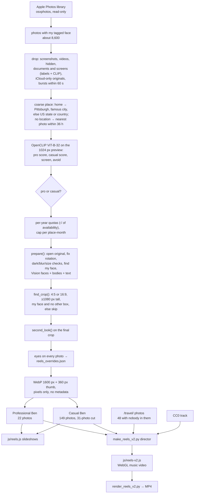

# Reels: Me, Over the Years

**Live:** https://ben.collier.phd/reels/
**Course:** CMU 15-113 Effective Coding with AI, Project 2 (Creative Web App)
**Works on phones:** yes. The stage switches from 16:9 to 4:5 below 760px wide.

## What it does

- 171 photos of me from my own Apple Photos library, 2000 to 2026, nobody else in any of them.
- **Version 2:** a 3:41 music video, drawn live in the browser with WebGL and cut to the beat of a CC0 track, in the neon style of K-pop animation. 190 shots: a cold open, 24 places, Professional Ben speeding into the first drop, Casual Ben, a breakdown, a second drop, and a closing mosaic of every photo.
- **Version 1:** two slideshows, "Professional Ben" (22 photos) and "Casual Ben" (a 31-photo cut of 149), with a slow pan and zoom, a taped place label and folk guitar.

## How to use it

- Press **play** on version 2. Sound starts only when you press play.
- Controls: pause and resume, a seek bar, mute, full screen.
- Keyboard, once the video has focus: Space or K plays and pauses, the arrow keys jump 5 seconds, M mutes, F goes full screen.
- With reduced motion turned on in your system settings, it plays the same cut without flashes, glitch, shake or spin.

## What I am most proud of

- (Pick your own. Candidates:)
- The privacy rule: crop until I am the only face, or leave the photo out. Never blur.
- The edit is real direction: shots are placed on the measured beat grid, and the drops land on the music.
- Every frame is a pure function of the song time, so seeking is exact and the same code renders an MP4.
- The second-look face check, added after Apple Vision missed a toddler and a kiss.

## How to run it locally

```bash
git clone https://github.com/bcollier/ben.collier.phd
cd ben.collier.phd
python3 scripts/build.py            # regenerate the pages (standard library only)
python3 -m http.server 8000         # then open http://localhost:8000/reels/
```

Seeking in version 2 needs a server that supports HTTP range requests (GitHub Pages does; `python3 -m http.server` does not), so on the plain local server the video plays from the start but jumps can snap back.

Rebuilding the photo selection needs my Mac and my Photos library:

```bash
pip install osxphotos open_clip_torch torch pillow pillow-heif numpy imageio-ffmpeg \
            pyobjc-framework-Vision pyobjc-framework-Quartz playwright
python scripts/make_reels.py --per-reel 150 --dry-run   # list the picks
python scripts/make_reels.py --per-reel 150             # v1: assets/reels/ + data/reels.json
python scripts/make_reels_v2.py                          # v2: data/reels_v2.json
python3 scripts/build.py
```

## Secrets

- There are none. No API keys, no backend, no database.
- All image analysis (Apple Vision, OpenCLIP) runs locally on my Mac. No photo is sent to any online service.
- Committed images carry no metadata: no EXIF, GPS, dates or camera data. `data/reels.json` stores only `{src, w, h, place}`.
- The private report (what was skipped and why) and the photo-to-file map live in `~/Library/Caches/ben-reels/`, outside the repo.

## How I used AI

- (Write this yourself. Facts:)
- Claude Code (Claude Opus 5.5) wrote most of the code from a detailed spec I wrote, then iterated on my feedback: home photos, removing repeated office shots, the K-pop version.
- I reviewed every photo by eye and decided what to drop.
- My own edits: (list the changes you make yourself, for example renaming a title in `scripts/make_reels_v2.py`, changing a bar pattern, or skipping a photo in `scripts/reels_overrides.json`).
- Full prompt history: [prompt_log.md](prompt_log.md). Diagrams and charts: [docs/reels-pipeline.md](../docs/reels-pipeline.md).

## Citations

- Music, version 2: "High Technologic Beat Explosion" by Loyalty Freak Music, from *Robot Dance!*, CC0 1.0, via the Internet Archive.
- Music, version 1: "Juillet" by Monplaisir, from *Bonjour from Paris, Nantes and Montreal*, CC0 1.0, via the Internet Archive. (Version 1 first shipped with "Travel to the Horizon" by Komiku, also CC0.)
- Libraries and tools: osxphotos, Apple Vision (via PyObjC), OpenCLIP (ViT-B-32, LAION-2B weights), NumPy, Pillow, ffmpeg, Playwright. Fonts: Black Han Sans, Kalam and IBM Plex Mono, from Google Fonts.
- Code: written with Claude Code (Claude Opus 5.5).

---

## AI-generated technical notes

*This section was written by Claude Code and is labelled as AI-generated, as the course allows.*

### Files

| File | What it does |
|---|---|
| `scripts/make_reels.py` | v1 pipeline: Photos → filter → classify → crop → export. Writes `assets/reels/` and `data/reels.json`. |
| `scripts/reels_overrides.json` | Hand review: Photos UUID → `skip`, `pro` or `casual`. |
| `scripts/make_reels_v2.py` | v2 director: finds each face, measures the beat grid, lays out shots by bar pattern. Writes `data/reels_v2.json`. |
| `scripts/reels_v2_broll.json` | The 48 already-public place photos used as b-roll. |
| `scripts/render_reels_v2.py` | Renders v2 to MP4 and the poster frames, via `?capture` in headless Chrome. |
| `js/reels-v2.js` | v2 player: one WebGL fragment shader plus a 2D canvas overlay, driven by the song clock. |
| `js/reels.js` | v1 slideshow player. |
| `scripts/reels_removed.json`, `scripts/reels_cut.json` | Photos pulled from both versions, and the 31-photo Casual Ben cut, by published file name. |
| `scripts/r2.py`, `workers/reels-media/` | Upload and serve rendered MP4s from Cloudflare R2 (see the main README). |
| `scripts/build.py` → `build_reels()` | Generates `reels/index.html`. |

### Pipeline

```mermaid
flowchart LR
  photos["Apple Photos<br/>(read-only)"] --> filter["filter: my face, no screens,<br/>not dark or blurry, one per burst"]
  filter --> sort["local CLIP: pro or casual,<br/>spread by year and place"]
  sort --> crop["Vision faces + bodies:<br/>crop to me alone, or skip"]
  crop --> check["second look on the final crop"]
  check --> v1["data/reels.json<br/>v1 slideshows"]
  v1 --> dir["make_reels_v2.py<br/>beat grid + bar patterns"]
  dir --> v2["data/reels_v2.json"] --> player["js/reels-v2.js<br/>WebGL"] --> page(["/reels/"])
```



### How the three videos were made

All three start from the same selection: `scripts/make_reels.py` reads Apple Photos read-only, keeps photos where Photos tagged "Benjamin Collier", and passes each one through the checks below. Only then does each video diverge.



| | Professional Ben | Casual Ben | Version 2 |
|---|---|---|---|
| Photos | 22 | 31 shown (149 exported) | all 171, plus 48 places |
| Chosen by | CLIP "suit, podium, classroom, headshot" over "hiking, beach, tourist", plus Photos labels; office repeats removed by hand | Everything not professional; cut picked by eye with no goofy faces | The director: every photo once, oldest to newest |
| Length | about 26 s | about 37 s | 3:41 |
| Timing | 1.2 s a photo | 1.2 s a photo | On a 140 BPM beat grid, 0.21 to 1.7 s a shot |
| Motion | Ken Burns pan and zoom, 0.35 s crossfade | Same | Push and punch zooms toward the face, grids, panels, kaleidoscope, glitch |
| Music | "Juillet", folk guitar, looped | Same | "High Technologic Beat Explosion", 140 BPM |
| Player | `js/reels.js`, two `` layers with CSS transitions | Same | `js/reels-v2.js`, WebGL shader + 2D canvas |

### Finding the music with AI

Claude cannot listen, so it sourced music by search and by measurement:

1. **Search for licence first.** It queried the Internet Archive's advanced search API (`archive.org/advancedsearch.php`) for albums by artists known to publish under CC0 (Komiku, Loyalty Freak Music, Monplaisir). It then read each album's metadata (`archive.org/metadata/<id>`) and kept only albums whose `licenseurl` is `creativecommons.org/publicdomain/zero/1.0`. A CC BY copy of a Komiku album also turned up, and it was rejected because CC BY requires attribution terms the brief wanted to avoid.
2. **Measure, since it cannot listen.** For version 2 it downloaded five candidates and, for each one, decoded the audio with ffmpeg, then measured the tempo (autocorrelation of an onset curve) and the loudness of every second. It printed each energy curve as a row of text characters to see the song's shape:

   ```
   hightech.mp3  221.4s   .:-:---===++====++@##*####**############%#*+*+##*#@*########%#%#***++==+=:
   ```

   It chose "High Technologic Beat Explosion" because that shape is a music video: a long build, a hard drop at 0:54, a breakdown, a second drop at 2:30 and an outro.
3. **Prepare the file.** ffmpeg strips the metadata, normalises loudness (`loudnorm`, -15 LUFS for version 2 and -18 for version 1) and encodes 128 kbps MP3. That gives 3.5 MB, under the 4 MB cap. The licence and source go in `assets/reels/v2-music.json`, which the page reads for its credit line.
4. **Version 1's track was swapped later** for "Juillet" by Monplaisir when I asked for something warmer and acoustic (PR #125).

### Matching the cuts to the beat

1. **Onset curve.** `beat_grid()` decodes the track to mono at 22,050 Hz and takes a 1,024-sample Hann-windowed FFT every 128 samples, which is 172 frames a second, 5.8 ms apart. It keeps bins 1 to 7, about 21 to 150 Hz, where the kick drum lives, and computes spectral flux: the sum of the positive rises in `log(1 + 10·|X|)` from one frame to the next. Then it normalises the result. The curve spikes on every kick.
2. **Tempo and phase search.** For every tempo from 80 to 180 BPM in 0.05 steps, and every phase in half-frame steps, it averages the flux at the predicted beats. The mean, not the sum, keeps faster tempos from winning just by having more beats. Best: **140.0 BPM, first beat 0.409 s**, so beat `n` falls at `0.409 + n × 0.4286 s`.
3. **Why not the first answer.** Full-band autocorrelation peaked at 69.8 BPM (half-time) and 93 BPM (a dotted hi-hat rhythm, 140 × 2/3). Restricting the analysis to the kick band fixed it, and the 80 to 180 range rules out the half-time reading.
4. **Sections.** The loudness of each beat jumps at beat 126 (the drop at 0:54) and again at 350 (2:30), and dips at 286 and 446. These beat numbers are set by hand in `SECTIONS` after that one-off analysis, so another song would need them measured again. Bars start on beats 2, 6, 10 and so on.
5. **Cutting.** Every shot's start and length is a whole number of beats, or half a beat in the risers, so cuts land on kicks. In the browser, `beatInfo(t)` computes `pulse = exp(-9 × seconds since the last beat)`, which drives the zoom punches and colour split, and the audio element is the master clock (resynced if the wall clock drifts by more than 80 ms).

### How the beat grid works

The track is decoded to mono, and a short-time Fourier transform is taken every 128 samples. The positive change in log energy between 30 and 150 Hz (the kick drum) gives an onset curve. Every tempo from 80 to 180 BPM, and every phase, is scored by the mean onset strength on its beats. The best is 140.0 BPM with the first beat at 0.409 s. A plain autocorrelation had picked 92 BPM, a dotted rhythm in the hi-hats, until the analysis was split by frequency band.

### How a frame is drawn

`render(t)` finds the shot at time `t` by binary search, and sets the shader uniforms from that shot's effects and the beat phase (`pulse = exp(-9 × time since the last beat)`). Then it draws one full-screen quad. The fragment shader's `MODE` selects fill, framed, 2x2 grid, triple panels or kaleidoscope. Colour split, glitch, duotone, zoom blur, flash, vignette, scanlines and grain are applied after that. The 2D overlay draws text, the seal, beams, sparkles, shockwaves, place chips and the mosaic. Nothing depends on the previous frame.
