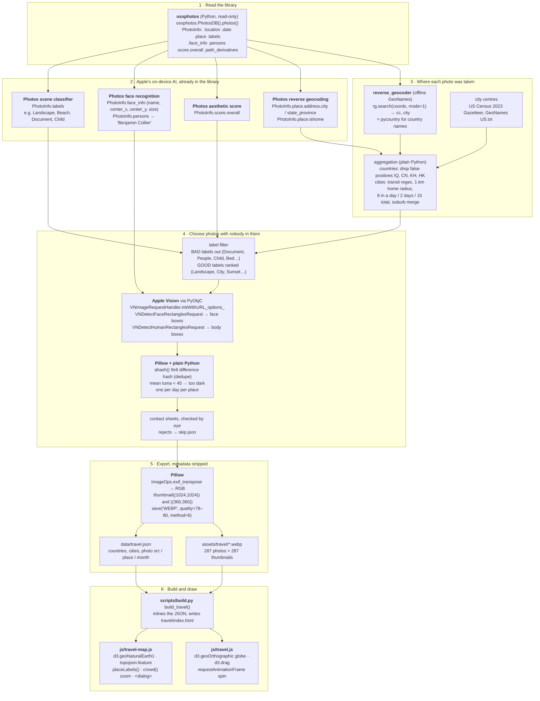

# Places I Have Been: the travel map

*Written by Claude Code from the build transcript and the code, for the site's documentation. The prompt history is in [prompt_log.md](prompt_log.md).*


## What it is

`/travel/` is an interactive map of every place I have been, built from my own Apple Photos library. It has two views:

- **Map** (default): a flat Natural Earth world map with every visited country shaded and dotted, plus smaller dots for US cities. Hovering a dot zooms into crowded regions and opens a photo card. Clicking pins the card, and clicking a photo opens it full size.
- **Globe**: an orthographic globe that turns slowly, can be dragged, and shows a crossfading photo card.

Counts, taken from `data/travel.json` and `assets/travel/`:

| | Count |
|---|---|
| Countries | 27 |
| US cities | 55 (in 15 states plus DC) |
| Country photos | 142 (1 to 10 per country) |
| US city photos | 145 (1 to 4 per city) |
| Photos in total | 287, each with a thumbnail: 574 files, about 34 MB |
| Photos in the library scanned | 129,597, of which 48,280 had GPS |

The pipeline that chose and exported the photos was one-off Python run on my Mac during a Claude Code session. It was never committed to the repo, because it reads my private Photos library and works with home-location data. Only the results (`data/travel.json` and `assets/travel/*.webp`) are in the repo. The scripts are described below as they were run.

## Data flow

Every box names the code that did the work. Nothing in this pipeline sent a photo to an online service. All the machine learning ran on my Mac, either inside Apple Photos or through Apple's Vision framework.



### Which AI ran where

| AI or ML | What it did here | How the code reached it |
|---|---|---|
| Apple Photos scene classifier (on-device) | The "search" for usable photos: keep landscapes, cities, food and sunsets; drop documents, screens, people, children, bedrooms and drinks | `PhotoInfo.labels`, read through osxphotos. No new model was run; Photos had already labelled every photo |
| Apple Photos face recognition (on-device) | Knows which face is me ("Benjamin Collier") and where every face sits | `PhotoInfo.persons`, `PhotoInfo.face_info` |
| Apple Photos aesthetic score (on-device) | Ranks the better-composed shot first | `PhotoInfo.score.overall` |
| Apple Photos reverse geocoding | City and state for US photos, and which photos were taken at home | `PhotoInfo.place.address`, `PhotoInfo.place.ishome` |
| Apple Vision framework (on-device) | A second, independent face and body detector, which catches people Photos never tagged | PyObjC: `Vision.VNDetectFaceRectanglesRequest`, `Vision.VNDetectHumanRectanglesRequest`, run with `VNImageRequestHandler` |
| Claude Code (Claude Opus 5.5) | Wrote and ran every script, made the contact sheets, reviewed them with me, and built the page | Terminal agent on my Mac |

The travel map did not use a semantic text-to-image search such as CLIP. That came later, for the photo reels, which use OpenCLIP prompts such as "a man in a suit and tie" (see [reels/README.md](../reels/README.md)).

### Stage by stage

**1. Reading the library.** `osxphotos.PhotosDB()` opens the Photos SQLite database read-only. Each `PhotoInfo` supplies `uuid`, `location` (lat, lon), `date`, `favorite`, `screenshot`, `selfie`, `hidden`, `ismovie`, `persons`, `face_info`, `labels` (Apple's on-device scene labels), `score.overall` (Apple's aesthetic score), `place` (Apple's own reverse-geocoded place: `place.address.city`, `place.address.state_province`, `place.names`, `place.ishome`), `path` and `path_derivatives` (the original file and Photos' 1024 px previews).

**2. Place extraction.**
- *Countries:* `reverse_geocoder.search(list_of_(lat, lon), mode=1)` maps each photo to the nearest GeoNames city with 1,000 or more people, returning `{name, admin1, cc, lat, lon}`. It runs entirely offline. `mode=1` is single-process; `mode=2` (multiprocessing) crashed when the script came from stdin. Country names come from `pycountry`, with a few overrides (for example "Vatican City", "Turkey").
- *US cities:* the US spec asked for Photos' own data rather than any outside geocoder, so `cities.py` uses `p.place.address.city` and `state_province` directly.

**3. Aggregation.**
- *Countries:* 31 country codes came back. Iraq, China and Cambodia were geotag false positives (one was an in-flight map), confirmed by me, and Hong Kong was airport-only. That leaves 27. Each country records `count` (all located photos) and `years` (first and last year, ignoring a bogus 1969 date by keeping years from 2000 on).
- *US cities:*
  - Drop photos whose Photos place names match airports, terminals, rest areas, travel plazas, turnpikes, gas brands or "interstate" (185 photos).
  - Drop photos within 1 km of home, where home is the median position of photos Photos flags `ishome` (14,091 photos). The home position stayed in a scratch file and never went near the repo.
  - A city qualifies if it has 8 or more photos on one day, photos on 2 or more days, or 15 or more photos in total. 205 places qualified.
  - Suburbs merge into anchor cities within a set radius (Pittsburgh 40 km, Chicago 35 km, San Francisco and Washington 25 km, and so on), then any other place within 15 km of a bigger one merges into it. That left 109 places.
  - I then chose a 15-photo minimum (75 places) and dropped towns that looked like family homes or regular getaways, so a dot would not reveal where relatives live. Photo review then removed cities with no usable photos, leaving 55.

**4. Photo selection.**

| Step | Countries | US cities |
|---|---|---|
| Hard exclusions | screenshots, videos, hidden, selfies, any photo with `persons` (any detected face) | the same, plus any photo where Photos names a person other than me |
| BAD labels (excluded) | Document, Receipt, Ticket, Map, Text, License Plate, Computer, Screenshot, Handwriting, Printed Page, Menu, Bed/Bedroom/Bedding, Toilet/Bathroom, Child, Baby, People, Selfie, Swimwear, Underwear, Lingerie, Alcohol/Wine/Beer/Cocktail/Liquor | the same idea, plus Interior Room, Whiteboard, Envelope, Credit Card, Bill, Adult, Television, Monitor, Car Seat, Vehicle Interior, Foot/Feet |
| GOOD labels | not used | ranked by, then required: Outdoor, Sky, Landscape, Building, Architecture, Food, Dish, Beach, Ocean, Lake, Mountain, Tree, Forest, City, Cityscape, Bridge, Street, Water, Sunset, Park, Waterfall, River, Monument, Garden, Flower, Coast, Snow, Cliff and others |
| Ranking | favourite, then `score.overall` | no faces first, number of GOOD labels, favourite, `score.overall` |
| Spread | per-day cap (3 a day for long trips, 8 for short); US country photos only from more than 80 km from Pittsburgh, 2 per city | 1 per day when a city has 4 or more days, 2 when 2 or 3, otherwise 4 |
| Face checks | none needed: photos with any face were excluded outright | Apple Vision `VNDetectFaceRectanglesRequest` boxes, matched against Photos `face_info` (`name`, `center_x`, `center_y`, `size`). My face (tagged "Benjamin Collier") is ignored. Photos faces that Vision missed are added. More than 3 other faces means skip. |
| Body check | none | Vision `VNDetectHumanRectanglesRequest`: skip if any body covers more than 1.2% of the frame |
| Dedupe | by eye | 64-bit difference hash (`ahash()`, 9x8 greyscale): skip if within Hamming distance 12 of a pick, or 8 of a rejected photo (catches re-imported copies under new IDs) |
| Darkness | by eye | skip if mean luma of a 32x32 greyscale copy is under 45 |
| Final choice | I picked by eye from contact sheets | 3 rounds of review sheets checked by eye; rejects go to `skip.json`, then re-pick |

**Blurring.** The US export has a `blur(im, faces)` function. It pads each face box by 45%, pixelates it to 1/24 size, applies a Gaussian blur, and pastes the result back through a feathered elliptical mask. The first US export blurred 4 photos. As review tightened, every photo with another person in it was skipped instead, so **no published photo is blurred**. Country photos never needed blurring, because any photo with a face was excluded. The site's `AGENTS.md` now states the same rule for the photo reels ("never blur instead of skipping").

**5. Export.** Pillow opens the source (Photos' derivative preview if present, else the original), applies `ImageOps.exif_transpose` (US) and converts to RGB.
- Full size: `thumbnail((1024, 1024))` for cities, `(1100, 1100)` for countries. Because most sources are Photos' 1024 px previews, 279 of the 287 large images are exactly 1024 px on the long side. The rest are 886 to 1100 px.
- Thumbnail: `thumbnail((360, 360))`.
- Both are saved as WebP (`quality` 72 to 80, `method=6`). Pillow writes no EXIF, XMP or GPS unless asked to, and a check across `assets/travel/` found 0 files with metadata.

**6. Build.** `scripts/build.py` `build_travel()` reads `data/travel.json`, inlines it as `<script type="application/json" id="travel-data">` (escaping `</`), writes the Map/Globe tabs, the map and globe mounts, the photo `<dialog>`, the lede and the country button list, and loads the four scripts. `write()` then cache-busts script URLs with a content hash (`travel-map.js?v=...`).

## Images

- **Naming.**
  - Country photos: `assets/travel/<cc>-<n>.webp`, for example `fr-3.webp`, where `cc` is the lower-case ISO alpha-2 code and `n` runs from 1.
  - US city photos: `assets/travel/us-<city-slug>-<state>-<n>.webp`, for example `us-grand-rapids-mi-2.webp`, where the slug is the city and state, lower-cased, with non-alphanumerics turned into hyphens.
  - Every image has a thumbnail with a `-t` suffix, for example `fr-3-t.webp`.
- **Sizes.** 1024 px on the long side (a few smaller, two at 1100), thumbnails 360 px.
- **How they were chosen.** Automated filters narrowed tens of thousands of candidates to a short list per place, then every published image was looked at on a contact sheet, the US ones in three rounds. Choices favour landscapes, landmarks, food and streets, spread across different trips.
- **Privacy rules.**
  - No people other than me. Photos with another person were skipped, not blurred, and none of the 287 published photos is blurred.
  - No names anywhere: not in filenames, alt text or captions. Captions are the place and month ("Grand Rapids, MI · June 2019"). Alt text is "City, ST, Month Year" for cities and "Country, place" for countries.
  - No metadata: images are re-encoded WebP with no EXIF and no GPS.
  - Dots never sit on a photo's own GPS position. Country dots use the GeoNames city centre of the city with the most photos, and the US country dot sits at the geographic centre of the country, labelled "Across the country". City dots use official centre points: US Census 2023 Gazetteer internal points (places, plus county subdivisions where needed) or GeoNames for unincorporated places.
  - Home: photos within 1 km of home are excluded. Pittsburgh gets a downtown dot like any other city.
  - Towns that look like relatives' homes or a regular getaway are left off.
  - Other things skipped: documents, receipts, screens, plates, bedrooms, bathrooms, private interiors, alcohol, a memorial site, and children anywhere.

## `data/travel.json` schema

```text
{
  "countries": [ Country, ... ]          // sorted by count, descending
}

Country {
  cc:     string   ISO 3166-1 alpha-2, e.g. "AU"
  id:     string   ISO 3166-1 numeric, zero padded, e.g. "036"; matches the
                   feature id in world-atlas countries-110m.json
  name:   string   display name
  city:   string   city the dot sits on (most-photographed city), or
                   "Across the country" for the US
  lat, lon: number dot position (city centre, 2 decimals)
  years:  [first, last]  four-digit year strings
  count:  number   all located photos in that country (not just published ones)
  photos: [Photo]  1 to 10 published photos
  cities?: [City]  US entry only
}

City {
  slug:   string   "<city>-<state>", e.g. "grand-rapids-mi"
  name:   string   city name
  state:  string   USPS code
  lat, lon: number official city centre (4 decimals)
  years:  [first, last]
  count:  number   photos in the city after home/transit filters and suburb merges
  photos: [Photo]  1 to 4
}

Photo {
  src:   string  path to the full-size WebP; the thumbnail is src with "-t" before ".webp"
  place: string  for countries, the GeoNames city the photo is nearest; for US cities, the city name
  date:  string  "YYYY-MM" (month only, by design)
  w, h:  number  pixel size of the full-size image
}
```

Example with the real shape (one photo shown per list):

```json
{
  "cc": "AU", "id": "036", "name": "Australia", "city": "Manly",
  "lat": -33.8, "lon": 151.29, "years": ["2014", "2014"], "count": 727,
  "photos": [
    {"src": "assets/travel/au-1.webp", "place": "Kirribilli", "date": "2014-12", "w": 1024, "h": 768}
  ]
}
```

```json
{
  "slug": "grand-rapids-mi", "name": "Grand Rapids", "state": "MI",
  "lat": 42.9612, "lon": -85.6556, "years": ["2013", "2023"], "count": 363,
  "photos": [
    {"src": "assets/travel/us-grand-rapids-mi-1.webp", "place": "Grand Rapids", "date": "2019-06", "w": 768, "h": 1024}
  ]
}
```

## Code interfaces

### Pipeline scripts (one-off, not in the repo)

| Script | Key calls | Takes | Produces |
|---|---|---|---|
| `travel/locate.py` | `osxphotos.PhotosDB().photos()`, `reverse_geocoder.search(coords, mode=1)`, `pycountry.countries.get(alpha_2=)` | the Photos library | `located.json`: one row per located photo `{uuid, lat, lon, cc, city, admin, date, fav, screenshot, persons, score, hidden, ismovie, selfie, w, h, labels}`, plus a per-country count table |
| `travel/small.py` | `db.get_photo(uuid)`, `p.exif_info.altitude`, `p.place.name` | `located.json` | printout for countries with 60 or fewer photos, used to spot flyovers |
| `travel/candidates.py` | `DROP`, `BAD`, `p.path_derivatives`, `PIL.Image.thumbnail`, `ImageDraw` | `located.json` | `cand/<CC>/NN.jpg` (re-encoded, no EXIF), `sheet_<CC>.jpg` contact sheets, `candidates.json` |
| `travel/picks.json` | written by hand during review | indices into each contact sheet | `{"US": [11, 16, ...], ...}` |
| `travel/export.py` | `rg.search`, `Image.thumbnail((1100,1100))`, `save("WEBP", quality=78, method=6)` | picks, candidates, `located.json` | `assets/travel/<cc>-<n>[-t].webp`, `data/travel.json` |
| `uscity/probe.py` | `p.place.address`, `p.place.ishome`, `db.persons_as_dict` | the Photos library | counts of US photos with place and home flags, and the name I am tagged under |
| `uscity/cities.py` | `p.place.address.city/state_province`, `p.place.names.area_of_interest`, `TRANSIT` regex, haversine `km()` | the Photos library | `qual.json` (places passing the three rules), and a private scratch file with the home position |
| merge step (inline) | `ANCHORS` list of (city, state, radius km), 15 km second pass | `qual.json` | `merged.json` `{city, state, n, days, years, merged[], lat, lon, uuids[]}` |
| `uscity/pick.py` | `vision_faces(path)` with `Vision.VNDetectFaceRectanglesRequest` and `VNImageRequestHandler.initWithURL_options_`; `vision_people(path)` with `VNDetectHumanRectanglesRequest`; `ahash(im)`; `gazetteer()` reading `rg_cities1000.csv`; `p.face_info` | `merged.json`, `skip.json` | `picks.json` per city: `{city, state, centre, n, years, picks: [{uuid, date, faces, src}]}` |
| centre lookup (inline) | Census `2023_Gaz_place_national.txt` (`INTPTLAT`, `INTPTLONG`), `2023_Gaz_cousubs_national.txt`, GeoNames `US.txt` | `picks.json` | `centre` and `centre_src` per city |
| `uscity/export.py` | `slug()`, `blur(im, faces)`, `ImageOps.exif_transpose`, `thumbnail((1024,1024))` and `(360,360)`, `save("WEBP", quality=80/74, method=6)` | `picks.json`, `skip.json` | `assets/travel/us-<slug>-<n>[-t].webp`, `cities_out.json`, `review_N.jpg`, `sheet_uuids.json` |

Vision boxes are normalized with the origin at bottom-left. `vision_faces` flips them to a top-left origin (`y = 1 - origin.y - height`) so they line up with osxphotos' `face_info.center_x/center_y`.

### `scripts/build.py`

| Name | Line | What it does |
|---|---|---|
| `load_json(name)` | 445 | reads `data/<name>` |
| `esc(text)` | 463 | HTML-escapes text |
| `NAV` | 474 | nav entries; `("travel/", "travel", "travel", "#c9dd92")` |
| `SUBJECTS` | 502 | page "Subject" values; `"travel": "places I have been"` |
| `sheet_head(root, crumbs, active)` | 505 | notebook header; looks up `SUBJECTS[active]` |
| `page(root, active, title, desc, canon, body, ..., scripts)` | 621 | wraps a page in head, nav, footer and extra scripts |
| `page_head(kicker, title, lede)` | 651 | the page title block ("Travel", "Places I have been", lede with live counts) |
| `versioned(content)` | 698 | adds `?v=<hash>` to local asset URLs |
| `write(rel, content)` | 714 | writes a generated file through `versioned()` |
| `build_travel()` | 2822 | builds `travel/index.html` from `data/travel.json` |

### `js/travel-map.js` (flat map, IIFE)

| Piece | Line | Notes |
|---|---|---|
| data setup | 12 to 20 | flattens US `cities` into the same `places` list as countries (`_city`, `parent`), marks the 5 biggest cities `_top`; `byId` maps numeric country ids to entries |
| projection | 30 to 33 | `fetch(countries-110m.json)`, `topojson.feature(atlas, atlas.objects.countries)` minus Antarctica (`"010"`), `d3.geoNaturalEarth1().fitExtent(...)` in a 960x500 viewBox, `d3.geoPath` |
| twin nudge | 46 to 57 | dots closer than `TWIN = 4` world px are pushed apart by `SEP = 16` screen px along their bearing; `pos(p, k)` returns the nudged position at zoom `k` |
| roomy and side | 61 to 71 | `_roomy` means 2 or fewer peers within 45 px; `_left` puts a label on the side away from a close neighbour |
| dots | 73 to 84 | `<g class="m-dot [m-city]" tabindex=0 role=button>` with circles `hit`, `pulse` and `core` and a `text.m-label`. Core radius: country `3 + min(3, log10(count))`, city `1.8 + min(1.4, log10(count)/2.6)` |
| `crowd(p)` | 90 | peers within 70 px (countries) or 45 px (cities); with 3 or more it returns a zone `{x, y, k, r, members}`. `k` is clamped to between 1.8 and 7 (10 when every member is a city) |
| `placeLabels(v, show)` | 104 | greedy placement: sort by "is the US" then count, try up to 6 spots (right, left, above, below, 2 further below/above), accept the first that avoids **hard** boxes (labels, country dots) and, unless lenient, **soft** boxes (city dots). The US label first tries a fixed point in the northern plains (`projection([-101, 46.5])`). Lenient mode applies only at full view (`v.k <= 1.2`) |
| `apply(v)` | 135 | sets the world `translate/scale` transform, counter-scales dots by `1/k`, thins land strokes, moves the leader line |
| `labelsFor(v)` | 143 | full view: roomy countries, countries with 250+ photos, and the top 5 cities. Zoomed: zone members only |
| `zoomTo(v)` / `zoomFor(p)` | 154 / 159 | `d3.interpolate` over `{k, x, y}`, 650 ms `easeCubicInOut` (0 ms with reduced motion); `zoomFor` enters a new zone or returns to full view |
| pointer tracker | 171 to 186 | `svg.on("pointermove")`: the nearest dot within `16/k` wins, else the visited country under the pointer. Leaving the zone radius or the SVG zooms back out unless a card is pinned |
| `show(p)` / `render(p)` | 203 / 209 | hover intent of 110 ms (60 ms when swapping). `render` fills `#map-pop` with the header, up to 8 thumbnail buttons and, for the US, city buttons, then crossfades if a card was already shown |
| `leaderPath` / `drawLeader` | 241 / 255 | quadratic curve from the dot to the card's top-right corner, drawn on with a `stroke-dashoffset` transition (520 ms) |
| `softHide()` | 266 | 700 ms grace period, then fade out; hovering the card cancels it |
| `pin(p)` | 280 | zooms, renders, marks the card pinned (red outline), highlights the matching country button; clicking elsewhere unpins |
| `open(p, i)` | 294 | fills `<dialog id="photo-view">` and calls `showModal()`; closes from the button or a backdrop click |
| tabs | 314 to 324 | Map/Globe `aria-selected` toggling; calls `window.startGlobe()` once, the first time |

### `js/travel.js` (globe, `window.startGlobe`)

| Piece | Line | Notes |
|---|---|---|
| setup | 5 to 19 | same data flattening (copies of each city with `_city`) |
| projection | 26 | `d3.geoOrthographic().scale(312).translate([320,320]).clipAngle(90).rotate([-20,-25])`, plus `d3.geoGraticule10()` |
| land and dots | 36 to 50 | `topojson.feature(world, world.objects.countries)`; visited land and dots respond to `mouseenter`, `focus`, `click` and Enter/Space |
| `draw()` | 55 | redraws paths; hides dots on the far side (`d3.geoDistance(dot, centre) < PI/2 - 0.05`) |
| `spin(t)` | 71 | `requestAnimationFrame` turning at 0.006 degrees per ms until the first drag, hover or pick; off under reduced motion |
| drag | 83 | `d3.drag()` rotates, with latitude clamped to plus or minus 70 degrees |
| `turnTo(p)` | 89 | 900 ms rotation to centre a country picked from the list |
| `open(p, evt, pinned)` | 99 | builds `#globe-card`: header, a stage of stacked images, a caption and thumbnails |
| `show(i)` / `restart()` | 124 / 133 | crossfade to photo `i`, caption "place · Month YYYY"; auto-advances every 2.6 s unless reduced motion |

### CSS (`css/site.css`)

- Travel block at lines 1115 to 1188: tabs, `.map-card`, globe styles, `.map-pop` (absolute, `left: 12px; bottom: 12px; width: 290px`, rise-in transition), `.m-leader`, `.mp-thumbs` (4-column grid, staggered `mp-in` animation using `--i`), `.m-label` (handwritten font with a white halo via `paint-order: stroke`), `.photo-view` dialog.
- Line 1521 on: map-first layout. Lines 1577 and 1578: city dot and label sizes.
- Under 760 px, `.map-pop` becomes `position: static` beneath the map, and the globe grid collapses to one column under 1100 px (the globe card also scrolls into view on narrow screens, under 52rem).
- A global `prefers-reduced-motion` rule (line 428) turns off every CSS transition and animation.

## Interaction details

- **Hover.** One pointer tracker on the SVG picks the nearest dot within 16 screen px, or the shaded country under the pointer. A short intent delay (110 ms, 60 ms when moving between dots) stops flicker when sweeping across Europe. Moving off waits 700 ms before fading, so the pointer can travel to the card.
- **Zoom into crowds.** Hovering a dot with 3 or more neighbours (70 px for countries, 45 px for US cities) eases the map into that cluster: Europe, the Gulf, Southeast Asia, or a cluster of US cities. Dots and labels keep their on-screen size. Leaving the cluster's radius eases back out, unless a card is pinned.
- **Twin dots.** Pairs whose photos sit almost on top of each other (Italy and Vatican City, Denmark and Sweden, Singapore and Malaysia) are nudged 16 px apart along their true bearing at every zoom level.
- **Labels.**
  - At full view: countries with room, countries with 250+ photos where they fit, the United States in the northern plains, and the 5 US cities with the most photos (Pittsburgh, Madison, Anaheim, Grand Rapids, Ohiopyle).
  - Zoomed in: every dot in the cluster.
  - Placement is greedy, with bounding-box collision checks.
- **Popup card.** Docked bottom-left over the empty South Pacific so it never covers a visited country. A dashed red leader line draws from the dot to the card, the card rises in, and the thumbnails pop in 45 ms apart. Switching places crossfades it.
  - The header shows the name, the years and the number of photos.
  - The US card also lists all 55 cities as buttons, and clicking one pins that city.
- **Pinning and the lightbox.** Clicking a dot, a shaded country or a country button pins the card (red outline). Clicking anywhere else unpins it. Clicking a thumbnail opens the full image in a modal `<dialog>` with a caption. It closes with the × button, a backdrop click or Escape.
- **Map vs globe.** Tabs switch views, and the globe code only runs the first time its tab is opened. The globe spins slowly, stops for good at the first drag, hover or pick, and rotates to a country chosen from the list. Its card crossfades through every photo of the place.
- **Keyboard.** Every dot is a focusable `role="button"`. Focus zooms and shows the card, and Enter or Space pins it. Country buttons below the map work for both views.
- **Touch and mobile.** Tap pins a card. Under 760 px the card sits below the map instead of over it, and the country buttons are the easiest way in on a phone.
- **Reduced motion.** With `prefers-reduced-motion: reduce`, zoom changes are instant, the globe does not spin or auto-advance, and all CSS transitions and animations are off.

## Known limitations

- **The pipeline is not reproducible from the repo.** The scripts lived in a scratch directory and are gone. Rebuilding means reconstructing them from this description, and the final choices depended on review by eye and a private skip list.
- **Geotags are imperfect.**
  - Countries come from GPS, so an in-flight photo or an imported photo can invent a visit (Iraq, China, Cambodia needed a human to rule them out).
  - Places without geotagged photos are missing entirely.
  - Bahrain is represented by a single airport photo.
- **Uneven photo counts.** Several countries have only 1 to 3 photos (Canada, Bahrain and Belgium have 1), and 11 US cities have a single photo.
- **City lists depend on judgement calls.** Suburb merge radii, the 15-photo minimum and the privacy drop list all shape the map, so a city I visited briefly or a family town is deliberately absent.
- **`count` is not the number of published photos.** It counts all located photos for the place after filtering, which is far more than the photos shown.
- **Country dots are city-based.** Each country dot sits on its most-photographed city (Canada's was later moved to the country's middle), so it is not the geographic centre.
- **Low resolution borders.** The 110m world atlas has no shapes for small states. Vatican City, Bahrain, Singapore and Aruba have dots but no shaded country, so they can only be reached through the dot or the country list.
- **Reduced-motion is partial in JS.** The CSS turns off transitions, but the leader line's d3 dash animation still runs.
- **Stale page description.** The meta description passed to `page()` still says "27 countries, mapped from my photos." and does not mention the US cities.
- **Large inline payload.** The whole `travel.json` is embedded in the page, and the two views duplicate the data flattening.
- **The PR #112 description is wrong.** It lists 57 city names under a "55" heading (Swanton and Schaumburg are not on the map). The data and the page are correct.
